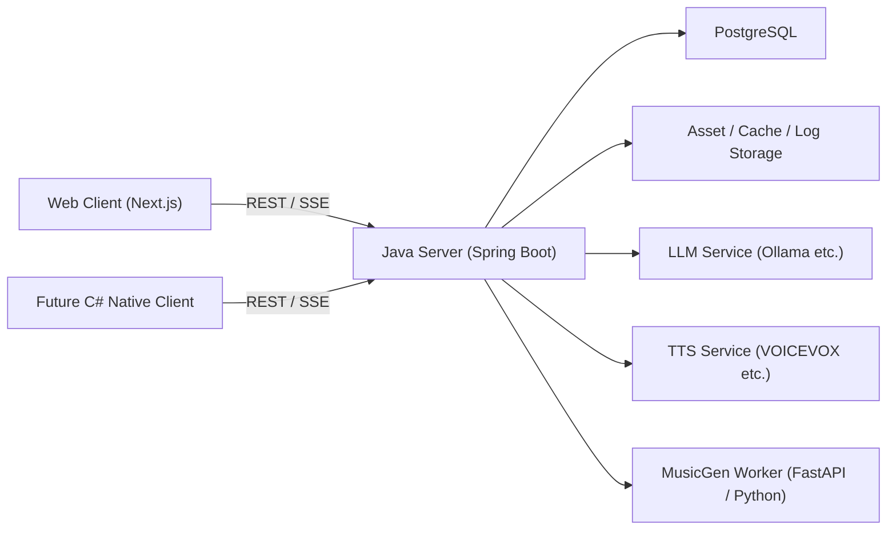

# AIローカルラジオアプリ アーキテクチャ方針設計書

## 1. 目的

本書は AI ローカルラジオアプリの MVP 実装で採用する全体アーキテクチャを定義する。対象は `Web Client`, `Java Server`, `Local AI Services`, `Persistence` である。

## 2. 設計原則

- Server を番組状態の正本とする
- Client は表示と操作に専念させる
- 生成系は Provider 抽象で差し替え可能にする
- 重い推論は Java 本体から分離する
- API First を徹底し、将来の C# Native Client を同じ契約で接続可能にする
- 再生停止より縮退継続を優先する

## 3. 推奨構成

| 層 | 主責務 | 主な技術 |
|---|---|---|
| Web Client | ラジオ画面、レター、設定、音声再生、SSE購読 | Next.js, React, TypeScript, TanStack Query, Zustand |
| Java Server | REST API, SSE, Playout, Queue, Config, Persistence, Provider Gateway | Spring Boot, Spring MVC, Spring Actuator, JobRunr |
| Local AI Services | LLM, TTS, MusicGen, 必要時 STT | Ollama, VOICEVOX, FastAPI Worker |
| Persistence | 設定、DB、生成資産、キャッシュ、ログ | PostgreSQL, Flyway, File Storage |

## 4. 全体構成



## 5. モジュール責務

| モジュール | 責務 |
|---|---|
| `web-client` | 画面表示、ユーザー入力、音声再生、SSE購読、軽量な LocalStorage 保存 |
| `api-gateway` | REST API, SSE endpoint, 入出力DTO, OpenAPI |
| `radio-control` | Tune, Play, Stop, Queue 正本, NowPlaying 正本 |
| `playout-engine` | セグメント選定、先読み、フェードアウト、フォールバック |
| `provider-gateway` | LLM/TTS/MusicGen の呼び出し統一、接続テスト、ヘルスチェック |
| `letter-service` | 投稿、一覧、状態遷移、放送採用、返信 |
| `programming-service` | 局ごとの番組編成ポリシー、テンプレート解決、番組 block 計画 |
| `config-service` | `config.json` 読み込み、外部設定、エクスポート/インポート |
| `asset-service` | 生成済み音声・音楽・キャッシュファイルの配置と配信 |
| `job-service` | 非同期生成、再試行、遅延ジョブ、ジョブ監視 |
| `observability` | 構造化ログ、メトリクス、ヘルス、監査イベント |

## 6. 同期/非同期の切り分け

### 6.1 同期で扱う処理

- 局一覧取得
- 現在状態取得
- Tune 要求受理
- レター投稿
- 設定参照
- 設定更新の妥当性チェック

### 6.2 非同期で扱う処理

- セグメント先読み生成
- 番組 block 計画生成
- TTS 音声生成
- MusicGen 実行
- キャッシュ削除
- ヘルススキャンと接続テスト

## 7. 通信方式

| 経路 | 方式 | 採用理由 |
|---|---|---|
| Client -> Server | REST | UI と将来クライアントで共通契約を維持しやすい |
| Server -> Client | SSE | NowPlaying, Queue, Buffer, Health の一方向通知に十分 |
| Server -> LLM/TTS/MusicGen | HTTP 優先 | 疎結合、接続テスト、プロセス分離がしやすい |
| Server -> MusicGen Worker | HTTP + 非同期ジョブ | 高遅延処理を切り離せる |

WebSocket は MVP の必須ではない。双方向の細かな再生制御や native client 用 push が不足した場合に追加する。

## 8. 推奨リポジトリ構成

```text
/server
/web
/workers/musicgen
/infra/compose
/doc
```

- `/server`: Spring Boot サーバー本体
- `/web`: Next.js Web UI
- `/workers/musicgen`: Python Worker
- `/infra/compose`: PostgreSQL, Ollama, VOICEVOX などのローカル起動定義

現行実装では物理的な `/server` 分離はまだ行わず、repo root を `server` 相当として扱う。`bootRun` は repo root から実行し、`/infra/compose` は PostgreSQL と Local AI service の依存起動定義として先行整備する。

## 9. 代表シーケンス

### 9.1 局切替

1. Client が `POST /api/radio/tune` を呼ぶ
2. Server が `playout-session` を新規作成または切替更新する
3. Server が旧キューを停止予定へ遷移させる
4. Server が先読みジョブを投入する
5. Server が `radio.status.changed`, `queue.updated` を SSE 配信する
6. Client が新キューの先頭セグメントを再生開始する

### 9.2 番組 block 計画

1. `playout-engine` が残り `ProgramSlot` を確認する
2. `programming-service` が有効な `ProgramTemplate` を解決し `ProgramBlock` を作成する
3. `job-service` が block 先頭寄りの slot を生成対象へ積む
4. `playout-engine` が `ProgramSlot` を `QueueItem` へ変換する
5. `queue.updated` と必要なら `program.changed` を SSE 配信する

### 9.3 TALK セグメント生成

1. `playout-engine` が不足バッファを検知する
2. `job-service` が台本生成ジョブを投入する
3. `provider-gateway` が LLM を呼ぶ
4. `JapaneseQualityGuard` が台本を整形する
5. TTS が必要なら音声生成を行う
6. `asset-service` が生成物を保存し `queue-item` を READY にする

## 10. 主要な設計判断

- Web UI は `SSR shell + Client Components` のハイブリッド構成とする
- `Server-side TTS` を Web の標準とし、`Client-side TTS` は契約のみ先行定義する
- MusicGen は別ワーカーへ分離し、Server はジョブ依頼と結果管理に集中する
- `config.json` は共有設定、DB は運用データ、LocalStorage は個別UI設定として分離する
- 局の正体を表す `Station` と、番組の構成を表す `ProgramTemplate` は別の責務として管理する
- 番組 block 計画が解決できない場合も、固定比率ベースへ戻して再生継続を優先する

## 11. 非機能と整合させる前提値

- Tune から再生開始までの目標: 5 秒以内
- 常時 Ready セグメント目標: 2 件以上
- MusicGen は高遅延前提とし、即時再生の経路から外す
- 同時接続はローカル利用を前提に 3 から 5 クライアントを目標とする

## 12. 将来拡張

- `C# Native Client` を同一 API 契約で追加する
- Client-side TTS のため `SpeechDirective` を維持する
- HLS や連結ストリームへ拡張しやすいよう `QueueItem` と `AssetManifest` を分離する
- `pgvector` を用いた文脈検索や再利用候補抽出を追加可能とする
