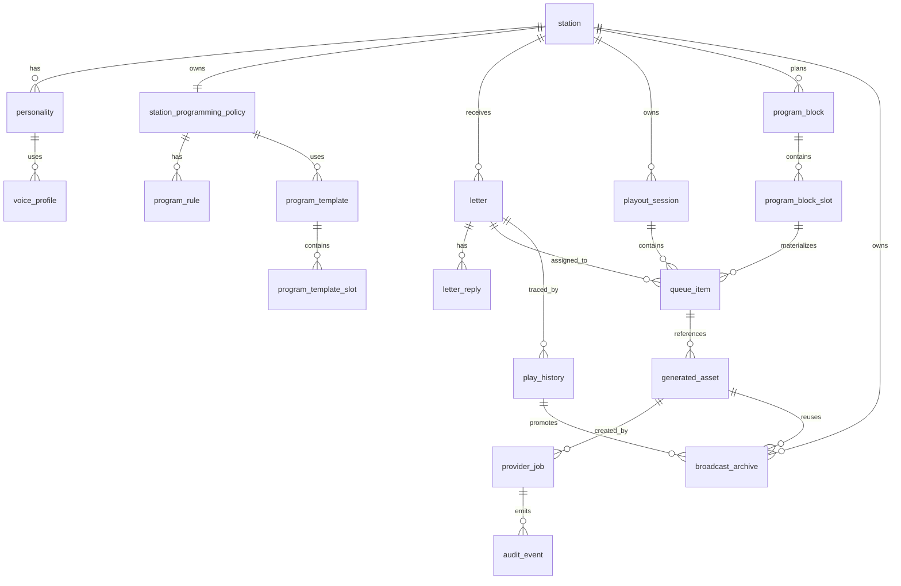

# AIローカルラジオアプリ データ構造設計書

## 1. 目的

本書は `config.json`, RDB, 生成資産, キャッシュ, ログの責務分担と構造を定義する。

## 2. 保存方式の役割分担

| 保存先 | 役割 | 正本 |
|---|---|---|
| `config.json` | 共有設定、初期局定義、パス、Provider 参照設定 | あり |
| PostgreSQL | レター、履歴、ジョブ、生成メタデータ、監査、client capability | あり |
| File Storage | 生成済み音声、生成済み音楽、ローカル音源索引、ログ | 一部あり |
| LocalStorage | UIの軽量状態 | クライアント限定 |

## 3. DB選定

- 標準 DB は `PostgreSQL` とする
- スキーマ管理は `Flyway` を使用する
- `pgvector` は将来の関連レター抽出や文脈検索用拡張として予約し、MVPでは必須にしない
- 開発簡易モードのみ `SQLite` を許容するが、本番相当検証は PostgreSQL で行う

### 3.1 コンテナデプロイ時の PostgreSQL 接続

- production deploy では PostgreSQL を compose 内に作らず、同一ホスト上の既存 PostgreSQL を正本として利用する
- Server container は `network_mode: host` で起動し、`SEEDSHIFT_RADIO_DB_HOST=127.0.0.1`, `SEEDSHIFT_RADIO_DB_PORT=5432` を標準接続先にする
- DB 名とユーザーは標準で `seedshift_radio` / `seedshift` を使い、既存 PostgreSQL の構成が異なる場合だけ GitLab CI/CD Variables または deploy runner の環境変数で上書きする。DB パスワードは GitLab CI/CD Variables または deploy runner の保護された環境変数から渡し、リポジトリには実値を置かない
- Flyway migration は deploy 前の `deploy-migrate` job で適用し、失敗した場合は Server / Web container の更新へ進めない

### 3.2 コンテナデプロイ時のファイル永続化

- Server container の `/var/lib/seedshift-radio` は `SEEDSHIFT_RADIO_DATA_VOLUME` で指定した Podman managed volume または絶対 host path を mount する。未設定時は `seedshift-radio-data` を使う
- MusicGen worker の `/data` は `deploy-musicgen` job で `MUSICGEN_DATA_VOLUME` が設定されている場合だけ mount する。未設定時は worker container 内の一時領域で、container 再作成時に生成物は残らない
- host path を使う場合は、Runner host 上で directory、実行ユーザーの書き込み権限、backup 方針を事前に準備し、絶対パスや秘密値を標準ログへ過剰に出さない

## 4. 推奨ディレクトリ構成

```text
/data/config/config.json
/data/assets/audio
/data/assets/scripts
/data/assets/music
/data/voice-references/irodori
/data/cache/tts
/data/cache/music
/data/library/music
/data/logs
```

## 5. 主要ER



## 6. 主要テーブル

### 6.1 `station`

| カラム | 型 | 説明 |
|---|---|---|
| `id` | varchar | 局ID |
| `name` | varchar | 局名 |
| `frequency_mhz` | numeric(4,1) | 周波数 |
| `genre` | varchar | ジャンル |
| `language_persona_id` | varchar | 既定人格 |
| `default_voice_profile_id` | varchar | 既定音声 |
| `programming_enabled` | boolean | 自動番組生成制御の有効化 |
| `default_program_template_id` | varchar | 既定テンプレート |
| `is_active` | boolean | 利用可否 |
| `version` | integer | 楽観ロック / 版管理 |
| `created_at` | timestamptz | 作成日時 |
| `updated_at` | timestamptz | 更新日時 |

制約:

- `frequency_mhz` は局ごとに一意とし、DB unique 制約で重複を防ぐ

### 6.2 `personality`

| カラム | 型 | 説明 |
|---|---|---|
| `id` | varchar | 人格ID |
| `station_id` | varchar | 対応局 |
| `display_name` | varchar | 表示名 |
| `language_tone` | varchar | 口調 |
| `first_person` | varchar | 一人称 |
| `sentence_style` | varchar | 敬体/常体 |
| `ng_policy` | jsonb | 禁則ルール |
| `pronunciation_dictionary_ref` | varchar | 読み辞書参照 |

### 6.3 `voice_profile`

| カラム | 型 | 説明 |
|---|---|---|
| `id` | varchar | 音声プロファイルID |
| `engine_type` | varchar | `VOICEVOX` など |
| `scope` | varchar | `GLOBAL` / `STATION`。局専用音声か共通音声か |
| `station_id` | varchar | `scope=STATION` の所属局 |
| `provider_key` | varchar | 明示的に使う TTS provider。未指定時は `engine_type` から解決 |
| `speaker_key` | varchar | 話者識別子 |
| `style_key` | varchar | スタイル識別子 |
| `speed` | numeric | 話速 |
| `pitch` | numeric | ピッチ |
| `playback_mode` | varchar | `SERVER_AUDIO` / `CLIENT_TTS` |
| `provider_options` | jsonb | engine 固有の安全な追加設定。Irodori では response format, style preset, chunking, inference option の allowlist |
| `reference_voice_ref` | varchar | 参照音声を使う engine 用の dataRoot 相対参照または provider voice id |
| `consent_policy_ref` | varchar | 参照音声・声質利用の同意、ライセンス、禁止事項への参照 |

Irodori-TTS の初期 adapter は既存 column だけでも `engine_type=IRODORI_TTS`, `speaker_key=<Irodori voice id>`, `style_key=<style preset>`, `speed=<OpenAI互換 speed>` として利用できる。ただし、チャンネルごとに声質を変える運用を標準化するため、`scope`, `station_id`, `provider_key`, `provider_options`, `reference_voice_ref`, `consent_policy_ref` を追加する。`scope=STATION` の VoiceProfile は指定 station からだけ選択でき、他局の `default_voice_profile_id` へ誤って割り当てない。参照音声の実ファイル path や個人名を API response / SSE / 標準ログへ出さない。`reference_voice_ref` は `dataRoot` 配下または Irodori server の `voices.json` id に限定し、任意の host path を受け付けない。

### 6.4 `letter`

| カラム | 型 | 説明 |
|---|---|---|
| `id` | varchar | レターID |
| `station_id` | varchar | 宛先局 |
| `radio_name` | varchar | ラジオネーム |
| `subject` | varchar | 件名 |
| `body` | text | 本文 |
| `status` | varchar | `UNREAD`, `PENDING`, `ADOPTED`, `REPLIED` |
| `adopted_in_session_id` | varchar | 採用セッション |
| `idempotency_key` | varchar | 二重投稿防止キー |
| `created_at` | timestamptz | 投稿日時 |
| `updated_at` | timestamptz | 更新日時 |

### 6.4.1 `letter_reply`

| カラム | 型 | 説明 |
|---|---|---|
| `id` | varchar | 返信ID |
| `letter_id` | varchar | 親レター |
| `reply_text` | text | 返信本文 |
| `created_at` | timestamptz | 返信日時 |

### 6.5 `playout_session`

| カラム | 型 | 説明 |
|---|---|---|
| `id` | varchar | セッションID |
| `station_id` | varchar | 現在局 |
| `state` | varchar | `IDLE`, `PREPARING`, `PLAYING`, `DEGRADED`, `STOPPED` |
| `current_queue_item_id` | varchar | 現在再生中 |
| `current_program_block_id` | varchar | 現在 block |
| `buffer_ready_count` | integer | Ready数 |
| `degraded_reason` | varchar | 縮退理由 |
| `started_at` | timestamptz | 開始時刻 |
| `updated_at` | timestamptz | 更新日時 |
| `correlation_id` | varchar | Tune 起点の相関ID |

### 6.6 `queue_item`

| カラム | 型 | 説明 |
|---|---|---|
| `id` | varchar | キューID |
| `session_id` | varchar | セッション |
| `sequence_no` | integer | 順序 |
| `segment_type` | varchar | `TALK`, `MUSIC_LOCAL`, `MUSIC_AI`, `JINGLE`, `LETTER` |
| `status` | varchar | `PLANNED`, `GENERATING`, `READY`, `PLAYING`, `DONE`, `FAILED`, `SKIPPED` |
| `program_block_id` | varchar | 番組 block 参照 |
| `program_slot_id` | varchar | 番組 slot 参照 |
| `slot_role` | varchar | `OPENING`, `TOPIC`, `LETTER`, `MUSIC_BREAK`, `ENDING` など |
| `title` | varchar | 表示タイトル |
| `playback_mode` | varchar | `SERVER_AUDIO` / `CLIENT_TTS` |
| `asset_url` | varchar | 生成物URL |
| `asset_id` | varchar | 生成資産参照 |
| `letter_id` | varchar | 採用レター参照 |
| `speech_directive_id` | varchar | Native向け発話指示参照 |
| `duration_ms` | integer | 見積または実時間 |
| `correlation_id` | varchar | 相関ID |
| `asset_banned` | boolean | 再利用禁止フラグ |
| `content_origin` | varchar | `LIVE_GEN`, `CACHE_REUSED`, `ARCHIVE_REPLAY`, `MUSIC_LOCAL_FALLBACK`, `MUSIC_LOCAL_PLACEHOLDER`, `JINGLE_FALLBACK`, `PLACEHOLDER` |
| `replay_of_play_history_id` | varchar | 再放送元の履歴参照 |
| `prepared_at` | timestamptz | 再生準備完了時刻 |
| `created_at` | timestamptz | 作成日時 |
| `updated_at` | timestamptz | 更新日時 |

用途:

- `segment_type = LETTER` の場合に `letter_id` を保存し、採用済みレターの放送実績と突合する
- `LETTER` 以外のセグメントでは `letter_id` は原則 `NULL` とする

### 6.7 `generated_asset`

| カラム | 型 | 説明 |
|---|---|---|
| `id` | varchar | 資産ID |
| `asset_type` | varchar | `SCRIPT`, `AUDIO`, `MUSIC` |
| `storage_path` | varchar | 保存先 |
| `content_hash` | varchar | 入力ハッシュ |
| `provider_fingerprint` | varchar | Provider識別 |
| `cache_key` | varchar | 再利用判定用の正規化キー |
| `metadata` | jsonb | seed, duration, promptHash 等 |
| `byte_size` | bigint | 実ファイルサイズ |
| `reuse_scope` | varchar | `DISABLED`, `SESSION`, `STATION`, `GLOBAL`, `ARCHIVE_ONLY` |
| `reuse_count` | integer | 再利用回数 |
| `last_accessed_at` | timestamptz | 最終参照時刻 |
| `expires_at` | timestamptz | 通常キャッシュ期限 |
| `archive_eligible` | boolean | 再放送候補化可否 |
| `queue_item_id` | varchar | 生成元 queue item |
| `provider_job_id` | varchar | 生成元 provider job |
| `created_at` | timestamptz | 作成日時 |

### 6.8 `provider_job`

| カラム | 型 | 説明 |
|---|---|---|
| `id` | varchar | ジョブID |
| `job_type` | varchar | `SCRIPT_GEN`, `TTS_GEN`, `MUSIC_GEN` |
| `provider_type` | varchar | `LLM`, `TTS`, `MUSIC` |
| `provider_key` | varchar | 実行 provider 識別 |
| `queue_item_id` | varchar | 対象 queue item |
| `status` | varchar | `QUEUED`, `RUNNING`, `SUCCEEDED`, `FAILED`, `CANCELLED` |
| `correlation_id` | varchar | 相関ID |
| `external_ref` | varchar | Worker 側 jobId など |
| `error_code` | varchar | エラー分類 |
| `started_at` | timestamptz | 開始時刻 |
| `ended_at` | timestamptz | 終了時刻 |

### 6.9 `station_programming_policy`

| カラム | 型 | 説明 |
|---|---|---|
| `id` | varchar | ポリシーID |
| `station_id` | varchar | 対象局 |
| `version` | integer | 楽観ロック用 version |
| `default_template_id` | varchar | 既定テンプレート |
| `fallback_strategy` | varchar | `LEGACY_RATIO`, `DEFAULT_TEMPLATE` |
| `planning_horizon_minutes` | integer | block 計画の先読み分数 |
| `pre_generation_policy` | jsonb | 先行生成深さと cache 優先度 |
| `replay_policy` | jsonb | station ごとの再放送強度と条件 |
| `composition_policy` | jsonb | talk / letter / music / jingle の混ぜ方 |
| `updated_at` | timestamptz | 更新日時 |

保存ルール:

- `station_programming_policy` は局ごとの番組編成ポリシーの正本であり、`GET /api/stations/{id}/programming` と `GET /api/stations/{id}` の `programming` はここから読み出す
- `pre_generation_policy`, `replay_policy`, `composition_policy` は JSONB で保存し、配列や比率の細目は API 側 DTO へそのまま往復できる形を保つ
- `config.json` は初期 seed と全局共通の既定値のみを持ち、運用中の個別局設定は DB に寄せる
- 3 つの profile のうち 1 つでも欠けた場合は、API 層で既定値へ補完してから返す
- `generated_asset.cache_key` と `generated_asset.reuse_scope` は cache-first 実行のための正規化キーと再利用範囲を表し、MusicGen の cache hit 判定で先に使う
- `last_accessed_at`, `reuse_count`, `expires_at`, `archive_eligible` は retention/eviction と archive 昇格のために使う。`expires_at` と cache size cap を超えた payload は eviction job が削除し、参照整合性維持のため DB record は `byte_size=0`, `cache_key=null`, `reuse_scope=DISABLED` として残す

### 6.10 `program_template`

| カラム | 型 | 説明 |
|---|---|---|
| `id` | varchar | テンプレートID |
| `scope` | varchar | `GLOBAL`, `STATION` |
| `station_id` | varchar | 局専用時の対象局 |
| `name` | varchar | 表示名 |
| `version` | integer | テンプレート version |
| `target_duration_minutes` | integer | 目標尺 |
| `planning_horizon_minutes` | integer | block 生成単位 |
| `is_active` | boolean | 利用可否 |
| `editorial_policy` | jsonb | 話題、温度感、NG、テンポ |
| `fallback_template_id` | varchar | 代替テンプレート |

### 6.11 `program_template_slot`

| カラム | 型 | 説明 |
|---|---|---|
| `id` | varchar | スロットID |
| `program_template_id` | varchar | 親テンプレート |
| `sequence_no` | integer | 順序 |
| `role` | varchar | `OPENING`, `TOPIC`, `LETTER`, `MUSIC_BREAK`, `ENDING` |
| `constraint_mode` | varchar | `HARD`, `SOFT` |
| `candidate_segment_types` | jsonb | 候補 `segmentType` 配列 |
| `fallback_segment_types` | jsonb | 代替候補 |
| `target_duration_ms` | integer | 目標尺 |
| `slot_policy` | jsonb | topicHints, requiredPhrases など |

### 6.12 `program_rule`

| カラム | 型 | 説明 |
|---|---|---|
| `id` | varchar | ルールID |
| `policy_id` | varchar | 親ポリシー |
| `priority` | integer | 優先度 |
| `days_of_week` | varchar | 適用曜日列 |
| `start_time` | varchar | 開始時刻 |
| `end_time` | varchar | 終了時刻 |
| `minimum_pending_letters` | integer | 最小未採用レター数 |
| `required_provider_states` | jsonb | 必要な Provider 状態 |
| `template_id` | varchar | 適用テンプレート |

### 6.13 `program_block`

| カラム | 型 | 説明 |
|---|---|---|
| `id` | varchar | 番組 block ID |
| `station_id` | varchar | 対象局 |
| `session_id` | varchar | playout session |
| `program_template_id` | varchar | 採用テンプレート |
| `program_template_version` | integer | 採用テンプレート version |
| `title` | varchar | 番組表示名 |
| `status` | varchar | `PLANNED`, `ACTIVE`, `DONE`, `CANCELLED` |
| `planned_duration_ms` | integer | 予定尺 |
| `started_at` | timestamptz | 開始時刻 |
| `ended_at` | timestamptz | 終了時刻 |

### 6.14 `program_block_slot`

| カラム | 型 | 説明 |
|---|---|---|
| `id` | varchar | block 内 slot ID |
| `program_block_id` | varchar | 親 block |
| `template_slot_id` | varchar | 元テンプレート slot |
| `sequence_no` | integer | 順序 |
| `role` | varchar | 役割 |
| `constraint_mode` | varchar | `HARD`, `SOFT` |
| `resolved_segment_type` | varchar | 解決済み `segmentType` |
| `status` | varchar | `PLANNED`, `QUEUED`, `DONE`, `SKIPPED` |
| `target_duration_ms` | integer | 目標尺 |
| `slot_context` | jsonb | topicHints, selectedLetterIds など |

### 6.15 `client_capabilities`

| カラム | 型 | 説明 |
|---|---|---|
| `client_id` | varchar | クライアント識別子 |
| `client_type` | varchar | `WEB`, `CSHARP_NATIVE` など |
| `supports_client_side_tts` | boolean | Client-side TTS 可否 |
| `supported_voice_engines` | jsonb | 利用可能エンジン一覧 |
| `preferred_playback_mode` | varchar | `SERVER_AUDIO` / `CLIENT_TTS` |
| `local_voice_profiles` | jsonb | ローカル音声候補 |
| `accepted_at` | timestamptz | 最終受付時刻 |
| `updated_at` | timestamptz | 更新時刻 |

用途:

- `POST /api/clients/capabilities` の最新状態を `clientId` 単位で保持する
- `GET /api/radio/next-speech-directive?clientId=...` の `voiceHint` 解決に使う

### 6.16 `play_history`

| カラム | 型 | 説明 |
|---|---|---|
| `id` | varchar | 再生履歴ID |
| `session_id` | varchar | 対象 session |
| `station_id` | varchar | 対象局 |
| `queue_item_id` | varchar | 対象 queue item |
| `letter_id` | varchar | 採用レター参照 |
| `program_block_id` | varchar | 対象 block |
| `program_slot_id` | varchar | 対象 slot |
| `segment_type` | varchar | 再生した `segmentType` |
| `title` | varchar | 表示タイトル |
| `playback_mode` | varchar | `SERVER_AUDIO` / `CLIENT_TTS` |
| `result_status` | varchar | `DONE`, `FAILED`, `STOPPED` |
| `correlation_id` | varchar | 相関ID |
| `content_origin` | varchar | `LIVE_GEN`, `CACHE_REUSED`, `ARCHIVE_REPLAY`, `MUSIC_LOCAL_FALLBACK`, `MUSIC_LOCAL_PLACEHOLDER`, `JINGLE_FALLBACK`, `PLACEHOLDER` |
| `replay_of_play_history_id` | varchar | 再放送元の履歴参照 |
| `played_at` | timestamptz | 確定時刻 |
| `created_at` | timestamptz | 記録時刻 |

用途:

- `SEGMENT_ENDED`, `SEGMENT_ERROR`, `PLAYBACK_STOPPED` 時の放送実績を保持する
- レター採用と後続の放送履歴突合に使う
- `queue_item.letter_id` で採用済みレターをキューへ割り当て、`play_history.letter_id` で放送結果へ引き継ぐ

### 6.17 `broadcast_archive`

| カラム | 型 | 説明 |
|---|---|---|
| `id` | varchar | 再放送候補ID |
| `station_id` | varchar | 所属局 |
| `source_play_history_id` | varchar | 元放送履歴 |
| `segment_type` | varchar | 再放送する `segmentType` |
| `title` | varchar | 表示タイトル |
| `primary_asset_id` | varchar | 主再生 asset |
| `script_asset_id` | varchar | TALK 系の script asset |
| `archive_status` | varchar | `CANDIDATE`, `ELIGIBLE`, `COOLDOWN`, `EXPIRED`, `EXCLUDED` |
| `replay_weight` | integer | 抽選重み |
| `replay_count` | integer | 再放送回数 |
| `eligible_from` | timestamptz | 再放送可能開始時刻 |
| `last_replayed_at` | timestamptz | 最終再放送時刻 |
| `expires_at` | timestamptz | 再放送期限 |
| `metadata` | jsonb | cue, safetyFlags, duration, contentHash 等 |

用途:

- `generated_asset` と `play_history` を直接スキャンせず、再放送候補を station ごとに管理する
- `LETTER` のような既定除外対象や、人格変更・NG 更新・利用条件更新で無効化すべき候補を明示的に管理する
- `replay_policy` の cooldown, weight, max share 制御に使う

## 7. `config.json` 設計

```json
{
  "version": 4,
  "schemaVersion": "2026-04",
  "server": {
    "bindHost": "127.0.0.1",
    "port": 8080
  },
  "paths": {
    "dataRoot": "./data",
    "musicLibrary": "./data/library/music",
    "voiceReferenceRoot": "./data/voice-references"
  },
  "playout": {
    "targetReadyCount": 3,
    "minimumReadyCount": 2,
    "minReadyDurationMs": 90000,
    "maxPreparedDurationMs": 480000,
    "maxPreparedBlocks": 2,
    "scriptAheadCount": 4,
    "ttsAheadCount": 3,
    "musicAheadCount": 2,
    "idlePrefetchEnabled": true
  },
  "cache": {
    "scriptMaxBytes": 134217728,
    "ttsMaxBytes": 536870912,
    "musicMaxBytes": 2147483648,
    "scriptRetentionDays": 7,
    "ttsRetentionDays": 30,
    "musicRetentionDays": 30,
    "scriptReuseScope": "STATION",
    "ttsReuseScope": "STATION",
    "musicReuseScope": "GLOBAL",
    "cleanupBatchSize": 200
  },
  "programming": {
    "defaultPlanningHorizonMinutes": 20,
    "legacyRatioFallback": true,
    "seedImportRef": "file:./data/config/programming-seed.json"
  },
  "providers": {
    "llm": {
      "defaultProvider": "ollama"
    },
    "tts": {
      "defaultProvider": "irodori",
      "fallbackProviders": ["voicevox"],
      "providers": {
        "irodori": {
          "baseUrl": "http://127.0.0.1:8088",
          "healthPath": "/health",
          "timeoutMs": 180000,
          "capabilities": [
            "TTS_GEN",
            "OPENAI_AUDIO_SPEECH",
            "IRODORI_TTS",
            "VOICE_CLONE",
            "STYLE_EMOJI",
            "LONG_TEXT_CHUNKING",
            "NO_STREAMING"
          ],
          "adapter": "IRODORI_OPENAI_TTS",
          "apiKeyRef": "env:IRODORI_TTS_API_KEY",
          "defaultModelProfileId": "irodori-tts"
        },
        "voicevox": {
          "baseUrl": "http://127.0.0.1:50021",
          "healthPath": "/version",
          "timeoutMs": 5000,
          "capabilities": ["TTS_GEN", "VOICEVOX"],
          "adapter": "VOICEVOX"
        }
      }
    },
    "musicGen": {
      "defaultProvider": "ace-step",
      "providers": {
        "ace-step": {
          "baseUrl": "http://127.0.0.1:8001",
          "healthPath": "/health",
          "timeoutMs": 10000,
          "capabilities": ["MUSIC_GEN", "ACE_STEP", "JAPANESE_LYRICS"],
          "adapter": "ACE_STEP",
          "apiKeyRef": "env:ACESTEP_API_KEY",
          "defaultModelProfileId": "ace-ja-fast"
        }
      }
    }
  },
  "security": {
    "adminTokenRef": "env:SEEDSHIFT_ADMIN_TOKEN"
  }
}
```

### 7.1 原則

- 機密値は `env:` や `file:` 参照で保持し、直書きしない
- `stations` と `programTemplates` の静的初期値は `config.json` または seed file に保持し、運用中の状態は DB に保持する
- 変更履歴が必要な設定は DB 側へ昇格可能とする
- `config.json` は `/api/settings` `GET`/`PUT` で読み書きされ、`version` で楽観ロック、`schemaVersion` でスキーマ互換性を確認する。
- Web の Import / Export は `config.json` の raw file restore ではなく、`SettingsUpdateRequest` 互換 JSON を draft として扱う。`updatedAt`, `configPath` は export せず、import でも書き込み対象として信頼しない。
- Import JSON の `schemaVersion` は現在の `config.json` と一致する場合のみ受け付け、`version` は現在値へ合わせてから `/api/settings` の楽観ロックと validation を通す。
- 設定の更新は `features` セクションを含めて placeholder の制御や Provider selection を動的に反映させる。
- `playout` は全局共通の上限値として使い、station ごとの `pre_generation_policy` はその範囲内でのみ深さを調整できる。station 側は `playout` を超える ready 件数や先読み深さを要求できない。
- `config.json.playout` の詳細項目は `/api/settings` で保存・返却される。現時点で runtime が直接参照しているのは `targetReadyCount` と `minReadyDurationMs` が中心で、他の項目は将来の queue warmup/refill 制御へ接続するための上限制約として保持する。
- `cache` は内部保存量の上限と reuse scope を制御し、station 側ポリシーより優先する安全弁とする
- `paths.voiceReferenceRoot` は参照音声ファイルの置き場を表す。初期実装では Irodori-TTS-Server の `voices/` volume へ同じ directory を mount し、Server は voice id / consent metadata だけを正本として扱う。任意 path upload や外部 URL 参照は許可しない。

### 7.2 `config.json` スキーマ

```json
{
  "version": 4,
  "schemaVersion": "2026-04",
  "server": { ... },
  "paths": {
    "dataRoot": "./data",
    "musicLibrary": "./data/library/music",
    "voiceReferenceRoot": "./data/voice-references"
  },
  "playout": {
    "targetReadyCount": 3,
    "minimumReadyCount": 2,
    "minReadyDurationMs": 90000,
    "maxPreparedDurationMs": 480000,
    "maxPreparedBlocks": 2,
    "scriptAheadCount": 4,
    "ttsAheadCount": 3,
    "musicAheadCount": 2,
    "idlePrefetchEnabled": true
  },
  "cache": {
    "scriptMaxBytes": 134217728,
    "ttsMaxBytes": 536870912,
    "musicMaxBytes": 2147483648,
    "scriptRetentionDays": 7,
    "ttsRetentionDays": 30,
    "musicRetentionDays": 30,
    "scriptReuseScope": "STATION",
    "ttsReuseScope": "STATION",
    "musicReuseScope": "GLOBAL",
    "cleanupBatchSize": 200
  },
  "programming": {
    "defaultPlanningHorizonMinutes": 20,
    "legacyRatioFallback": true,
    "seedImportRef": "file:./data/config/programming-seed.json"
  },
  "features": {
    "streaming": {
      "placeholderEnabled": true
    }
  },
  "providers": {
    "llm": {
      "defaultProvider": "ollama",
      "fallbackProviders": [],
      "providers": {
        "ollama": {
          "baseUrl": "http://127.0.0.1:11434",
          "healthPath": "/api/tags",
          "timeoutMs": 5000,
          "capabilities": ["SCRIPT_GEN"]
        }
      }
    },
    "tts": {
      "defaultProvider": "irodori",
      "fallbackProviders": ["voicevox"],
      "providers": {
        "irodori": {
          "baseUrl": "http://127.0.0.1:8088",
          "healthPath": "/health",
          "timeoutMs": 180000,
          "capabilities": ["TTS_GEN", "OPENAI_AUDIO_SPEECH", "IRODORI_TTS", "VOICE_CLONE", "STYLE_EMOJI", "LONG_TEXT_CHUNKING", "NO_STREAMING"],
          "adapter": "IRODORI_OPENAI_TTS",
          "apiKeyRef": "env:IRODORI_TTS_API_KEY",
          "defaultModelProfileId": "irodori-tts"
        },
        "voicevox": {
          "baseUrl": "http://127.0.0.1:50021",
          "healthPath": "/version",
          "timeoutMs": 5000,
          "capabilities": ["TTS_GEN", "VOICEVOX"],
          "adapter": "VOICEVOX"
        }
      }
    },
    "musicGen": {
      "defaultProvider": "ace-step",
      "fallbackProviders": [],
      "providers": {
        "ace-step": {
          "baseUrl": "http://127.0.0.1:8001",
          "healthPath": "/health",
          "timeoutMs": 10000,
          "capabilities": ["MUSIC_GEN", "ACE_STEP", "JAPANESE_LYRICS"],
          "adapter": "ACE_STEP",
          "apiKeyRef": "env:ACESTEP_API_KEY",
          "defaultModelProfileId": "ace-ja-fast",
          "modelProfiles": {
            "ace-ja-fast": {
              "model": "acestep-v15-turbo",
              "lmModel": "acestep-5Hz-lm-0.6B",
              "thinking": true,
              "lyricsLanguage": "ja",
              "lyricsTransliterationMode": "native",
              "outputFormat": "wav",
              "maxDurationSeconds": 120
            },
            "ace-ja-xl-fast": {
              "model": "acestep-v15-xl-turbo",
              "lmModel": "acestep-5Hz-lm-1.7B",
              "thinking": true,
              "lyricsLanguage": "ja",
              "lyricsTransliterationMode": "native",
              "outputFormat": "wav",
              "maxDurationSeconds": 240
            }
          }
        }
      }
    }
  },
  "security": {
    "adminTokenRef": "env:SEEDSHIFT_ADMIN_TOKEN"
  }
}
```

`providers` の `defaultProvider`, `fallbackProviders`, endpoint map は `/api/settings/test-connections` で随時検証し、`status` に `UP/DEGRADED/DOWN` を出す。`features.streaming.placeholderEnabled` が `true` なら asset 配信に placeholder が使われる。

`providers.tts.providers.{providerKey}` は `adapter` として `VOICEVOX` または `IRODORI_OPENAI_TTS` を持てる。Irodori adapter は OpenAI 互換の `/v1/audio/speech` を使い、Provider endpoint には接続先と認証参照だけを置く。Irodori の声質・style・chunking・response format など station/voice ごとの設定は `voice_profile.provider_options` に置く。

`providers.musicGen.providers.{providerKey}` は通常 endpoint に加えて `adapter`, `apiKeyRef`, `defaultModelProfileId`, `modelProfiles` を持つ。`adapter=ACE_STEP` では `apiKeyRef` を `Authorization: Bearer` の秘密値参照として解決し、profile の `model`, `lmModel`, `thinking`, `lyricsLanguage`, `lyricsTransliterationMode`, `outputFormat`, `maxDurationSeconds` を `MusicGenerationRequest` の正規化に使う。秘密値直書きは validation error とし、空値または `env:` / `file:` 参照だけを許可する。

生成本文の保存方針として、`generated_asset.metadata` には `promptHash`, `lyricsHash`, `model`, `lmModel`, `seed`, `duration`, `modelProfileId`, `lyricsLanguage` などの短いメタだけを保存する。prompt / lyrics / letter body / radioName / API key は標準ログ、SSE、API response、metadata へ生で残さない。

TTS 音声の `generated_asset.metadata` には `normalizedTextHash`, `voiceProfileId`, `engineType`, `providerKey`, `model`, `responseFormat`, `durationMs`, `stylePreset`, `referenceVoiceHash`, `consentPolicyRef` のような短い再現用メタだけを保存する。Irodori の参照音声ファイル path、参照元の個人名、レター本文、radioName、API key は保存しない。

`playout` は設計契約として `targetReadyCount`, `minimumReadyCount`, `minReadyDurationMs`, `maxPreparedDurationMs`, `maxPreparedBlocks`, `scriptAheadCount`, `ttsAheadCount`, `musicAheadCount`, `idlePrefetchEnabled` を持つ。保存時 validation として `minimumReadyCount <= targetReadyCount`, `maxPreparedDurationMs >= minReadyDurationMs`, 各 ahead count / block count は 0 以上を要求する。現時点の実装は基本項目を先行利用しており、`musicAheadCount` は `MUSIC_AI` の非同期生成を同時に何件まで前倒しするかへ first step 反映済みで、`0` を指定した場合でも直近再生候補 1 件ぶんの生成は継続性のため維持する。加えて `scriptAheadCount` / `ttsAheadCount` も queue warmup/refill の first step として反映し、future spoken queue item に対して script snapshot と TTS audio asset を何件先まで完成させるかを制御する。`ttsAheadCount=0` でも次に再生される spoken item 1 件ぶんの audio 生成は維持し、script 側の深さは audio 深さより浅くならない。`idlePrefetchEnabled=false` の場合は manual play 待機中に `minimumReadyCount` / `minReadyDurationMs` を満たした後の extra prefetch を最小化し、active playback や `resumePlayback=true` の warmup は維持する。ahead count のさらに細かい運用整理は引き続き後続実装対象とする。

## 8. キャッシュ設計

### 8.1 対象

- 台本
- TTS 音声
- Music Generation 音楽、ACE-Step 日本語歌もの

### 8.2 キャッシュキー

`generated_asset.cache_key = sha256(providerIdentity + reuseScope + normalizedInput)`

`normalizedInput` には少なくとも以下を含める。

- prompt / lyrics の hash
- provider / adapter / model / lm model / modelProfileId
- TTS engine / voice profile / reference voice hash / style preset / response format
- lyricsLanguage / lyricsTransliterationMode
- station / persona / voice profile
- program template / slot version
- seed
- target duration
- bpm / keyScale / timeSignature
- outputFormat / model version

`generated_asset.content_hash` は保存ファイル実体の整合確認に使い、`cache_key` は再利用候補検索に使う。

### 8.3 ポリシー

- 保存上限は `config.json.cache.scriptMaxBytes`, `ttsMaxBytes`, `musicMaxBytes` で制御する
- 台本: 7 日
- TTS: 30 日
- MusicGen: 30 日または容量上限到達まで
- 孤児ファイルは日次でクリーンアップする

### 8.4 再利用範囲

- `DISABLED`: 再利用しない
- `SESSION`: 同一 session のみ再利用
- `STATION`: 同一 station 内で再利用
- `GLOBAL`: station を越えて再利用
- `ARCHIVE_ONLY`: 通常 cache としては使わず、`broadcast_archive` 昇格後のみ再利用

### 8.5 Eviction 順序

1. `expires_at` を過ぎた asset
2. `asset_banned` や `archive_eligible=false` になった参照先
3. `last_accessed_at` が古く `reuse_count` も低い asset
4. それでも不足する場合のみ `broadcast_archive` 未参照の asset

現時点の実装では `generated_asset.cache_key` による再利用、`last_accessed_at` の更新、`reuse_count` の増分、`expires_at` と種別別 size cap に基づく payload eviction、`cleanupBatchSize` を使う定期 job まで対応する。`queue_item.asset_id` や `broadcast_archive` の FK を壊さないため、eviction は DB record を物理削除せず、payload file を削除して cache 対象から外す。同一 `storage_path` を複数 record が共有している場合は、最後の active record になるまで実ファイルは削除しない。`archive_eligible=true` の asset は archive 昇格と再放送正本の保持方針を優先し、この job の候補から外す。

`GET /api/monitor/assets/consistency` は DB record と file storage の read-only 検査を行う。`byte_size > 0` の asset は `storage_path` が通常ファイルとして存在し、`byte_size` と `content_hash` が payload file と一致することを期待する。`byte_size=0`, `cache_key=null`, `reuse_scope=DISABLED` の eviction 済み record は payload file が無くても正常扱いとするが、active record から参照されない残存 payload file は孤児ファイルとして検出する。検査対象の孤児ファイルは `dataRoot/assets/audio`, `dataRoot/assets/scripts`, `dataRoot/assets/music` 配下に限定し、自動削除や DB 修復は行わない。API response では絶対パスや raw metadata を返さず、`dataRoot` 相対パスと issue type / 件数のみを返す。

## 9. ログ/監査データ

- 構造化ログはファイル出力とし、必要に応じて DB 集約は Phase 2 で検討する
- 監査対象は設定変更、局切替、局設定変更、番組テンプレート変更、レター状態変更、Provider 異常、縮退切替とする
- レター本文全文やプロンプト全文は標準ログへ出さない

## 10. マイグレーション方針

- DB スキーマは `Flyway` で管理する
- 破壊的変更は `Vxxx__` のマイグレーションとアプリ側互換コードを同時に入れる
- `config.json` は `schemaVersion` を持たせ、起動時に変換可能とする
