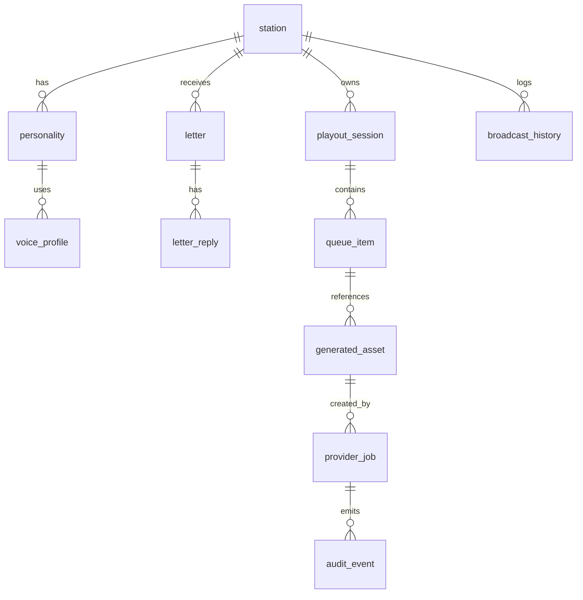

# AIローカルラジオアプリ データ構造設計書

## 1. 目的

本書は `config.json`, RDB, 生成資産, キャッシュ, ログの責務分担と構造を定義する。

## 2. 保存方式の役割分担

| 保存先 | 役割 | 正本 |
|---|---|---|
| `config.json` | 共有設定、初期局定義、パス、Provider 参照設定 | あり |
| PostgreSQL | レター、履歴、ジョブ、生成メタデータ、監査 | あり |
| File Storage | 生成済み音声、生成済み音楽、ローカル音源索引、ログ | 一部あり |
| LocalStorage | UIの軽量状態 | クライアント限定 |

## 3. DB選定

- 標準 DB は `PostgreSQL` とする
- スキーマ管理は `Flyway` を使用する
- `pgvector` は将来の関連レター抽出や文脈検索用拡張として予約し、MVPでは必須にしない
- 開発簡易モードのみ `SQLite` を許容するが、本番相当検証は PostgreSQL で行う

## 4. 推奨ディレクトリ構成

```text
/data/config/config.json
/data/assets/audio
/data/assets/music
/data/cache/scripts
/data/cache/tts
/data/cache/music
/data/library/music
/data/logs
```

## 5. 主要ER



## 6. 主要テーブル

### 6.1 `station`

| カラム | 型 | 説明 |
|---|---|---|
| `id` | varchar | 局ID |
| `name` | varchar | 局名 |
| `frequency_mhz` | numeric(4,1) | 周波数 |
| `genre` | varchar | ジャンル |
| `language_persona_id` | varchar | 既定人格 |
| `default_voice_profile_id` | varchar | 既定音声 |
| `is_active` | boolean | 利用可否 |

### 6.2 `personality`

| カラム | 型 | 説明 |
|---|---|---|
| `id` | varchar | 人格ID |
| `station_id` | varchar | 対応局 |
| `display_name` | varchar | 表示名 |
| `language_tone` | varchar | 口調 |
| `first_person` | varchar | 一人称 |
| `sentence_style` | varchar | 敬体/常体 |
| `ng_policy` | jsonb | 禁則ルール |
| `pronunciation_dictionary_ref` | varchar | 読み辞書参照 |

### 6.3 `voice_profile`

| カラム | 型 | 説明 |
|---|---|---|
| `id` | varchar | 音声プロファイルID |
| `engine_type` | varchar | `VOICEVOX` など |
| `speaker_key` | varchar | 話者識別子 |
| `style_key` | varchar | スタイル識別子 |
| `speed` | numeric | 話速 |
| `pitch` | numeric | ピッチ |
| `playback_mode` | varchar | `SERVER_AUDIO` / `CLIENT_TTS` |

### 6.4 `letter`

| カラム | 型 | 説明 |
|---|---|---|
| `id` | varchar | レターID |
| `station_id` | varchar | 宛先局 |
| `radio_name` | varchar | ラジオネーム |
| `subject` | varchar | 件名 |
| `body` | text | 本文 |
| `status` | varchar | `UNREAD`, `PENDING`, `ADOPTED`, `REPLIED` |
| `adopted_in_session_id` | varchar | 採用セッション |
| `created_at` | timestamptz | 投稿日時 |

### 6.5 `playout_session`

| カラム | 型 | 説明 |
|---|---|---|
| `id` | varchar | セッションID |
| `station_id` | varchar | 現在局 |
| `state` | varchar | `IDLE`, `PREPARING`, `PLAYING`, `DEGRADED`, `STOPPED` |
| `current_queue_item_id` | varchar | 現在再生中 |
| `buffer_ready_count` | integer | Ready数 |
| `started_at` | timestamptz | 開始時刻 |

### 6.6 `queue_item`

| カラム | 型 | 説明 |
|---|---|---|
| `id` | varchar | キューID |
| `session_id` | varchar | セッション |
| `sequence_no` | integer | 順序 |
| `segment_type` | varchar | `TALK`, `MUSIC_LOCAL`, `MUSIC_AI`, `JINGLE`, `LETTER` |
| `status` | varchar | `PLANNED`, `GENERATING`, `READY`, `PLAYING`, `DONE`, `FAILED`, `SKIPPED` |
| `asset_id` | varchar | 生成資産参照 |
| `speech_directive_id` | varchar | Native向け発話指示参照 |
| `duration_ms` | integer | 見積または実時間 |

### 6.7 `generated_asset`

| カラム | 型 | 説明 |
|---|---|---|
| `id` | varchar | 資産ID |
| `asset_type` | varchar | `SCRIPT`, `AUDIO`, `MUSIC` |
| `storage_path` | varchar | 保存先 |
| `content_hash` | varchar | 入力ハッシュ |
| `provider_fingerprint` | varchar | Provider識別 |
| `metadata` | jsonb | seed, duration, promptHash 等 |
| `created_at` | timestamptz | 作成日時 |

### 6.8 `provider_job`

| カラム | 型 | 説明 |
|---|---|---|
| `id` | varchar | ジョブID |
| `job_type` | varchar | `SCRIPT_GEN`, `TTS_GEN`, `MUSIC_GEN` |
| `provider_type` | varchar | `LLM`, `TTS`, `MUSIC` |
| `status` | varchar | `QUEUED`, `RUNNING`, `SUCCEEDED`, `FAILED`, `CANCELLED` |
| `correlation_id` | varchar | 相関ID |
| `error_code` | varchar | エラー分類 |
| `started_at` | timestamptz | 開始時刻 |
| `ended_at` | timestamptz | 終了時刻 |

## 7. `config.json` 設計

```json
{
  "server": {
    "bindHost": "127.0.0.1",
    "port": 8080
  },
  "paths": {
    "dataRoot": "./data",
    "musicLibrary": "./data/library/music"
  },
  "playout": {
    "targetReadyCount": 3,
    "minReadyDurationMs": 90000
  },
  "providers": {
    "llm": {
      "defaultProvider": "ollama"
    },
    "tts": {
      "defaultProvider": "voicevox"
    },
    "musicGen": {
      "defaultProvider": "ace-step"
    }
  },
  "security": {
    "adminTokenRef": "env:SEEDSHIFT_ADMIN_TOKEN"
  }
}
```

### 7.1 原則

- 機密値は `env:` や `file:` 参照で保持し、直書きしない
- `stations` の静的初期値は `config.json` に保持し、運用中の状態は DB に保持する
- 変更履歴が必要な設定は DB 側へ昇格可能とする

## 8. キャッシュ設計

### 8.1 対象

- 台本
- TTS 音声
- MusicGen 音楽

### 8.2 キャッシュキー

`{providerType}/{providerFingerprint}/{contentHash}`

`contentHash` には少なくとも以下を含める。

- 入力本文
- station / persona / voice profile
- seed
- target duration
- model version

### 8.3 ポリシー

- 台本: 7 日
- TTS: 30 日
- MusicGen: 30 日または容量上限到達まで
- 孤児ファイルは日次でクリーンアップする

## 9. ログ/監査データ

- 構造化ログはファイル出力とし、必要に応じて DB 集約は Phase 2 で検討する
- 監査対象は設定変更、局切替、レター状態変更、Provider 異常、縮退切替とする
- レター本文全文やプロンプト全文は標準ログへ出さない

## 10. マイグレーション方針

- DB スキーマは `Flyway` で管理する
- 破壊的変更は `Vxxx__` のマイグレーションとアプリ側互換コードを同時に入れる
- `config.json` は `schemaVersion` を持たせ、起動時に変換可能とする
