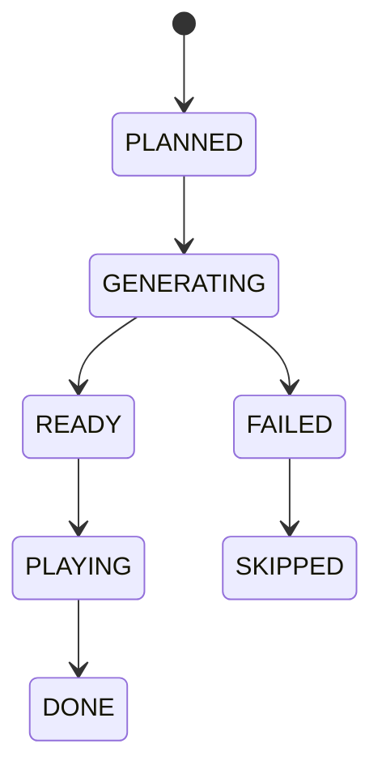

# AIローカルラジオアプリ プレイアウト・キュー制御設計書

## 1. 目的

本書は番組連続再生を止めないための `Queue`, `Buffer`, `Segment Lifecycle`, `Fallback` を定義する。

## 2. 基本方針

- Server がキュー正本を持つ
- Client は順次再生する
- キュー補充は固定比率ではなく、可能な限り有効な `ProgramBlock` を優先する
- セグメントは 20 から 60 秒を目安とする
- `READY` セグメントを常時 2 件以上確保する
- 失敗時は再生停止より代替再生を優先する

## 3. セッション状態

| 状態 | 説明 |
|---|---|
| `IDLE` | 局未選択 |
| `PREPARING` | 局切替直後で初期キュー生成中 |
| `PLAYING` | 通常再生中 |
| `DEGRADED` | 代替セグメントを使用中 |
| `STOPPED` | 明示停止 |
| `ERROR` | 手動復旧が必要 |

状態遷移は `playout_session.state` を正本とする。

## 4. QueueItem ライフサイクル

実装上は QueueItem を `READY` または `GENERATING` で作成することがある。`SEGMENT_ERROR` や非同期生成失敗で `QueueItem` を `FAILED` にした場合は、対応する `ProgramBlockSlot` を `SKIPPED` に進め、block 完了判定が詰まらないようにする。

## 5. バッファ制御

### 5.1 初期値

- `targetReadyCount = 3`
- `minimumReadyCount = 2`
- `minReadyDurationMs = 90000`
- `maxPreparedDurationMs = 480000`
- `maxPreparedBlocks = 2`
- 初期キュー作成と先読み補充は、`after-commit` で JobRunr ジョブへ委譲し、`Tune` 応答は `PREPARING` のまま返す

### 5.2 補充条件

以下のいずれかを満たしたら先読み生成ジョブを投入する。

- Ready 件数が 2 未満
- Ready 合計見積時間が 90 秒未満
- 残り `ProgramSlot` が 2 件未満
- MusicGen セグメントが先頭 3 件以内にある

### 5.3 先行生成の深さ

- 全局共通の上限は `config.playout.maxPreparedDurationMs`, `maxPreparedBlocks`, `scriptAheadCount`, `ttsAheadCount`, `musicAheadCount` で制御する
- station ごとの `preGeneration.mode` が `REALTIME_ONLY` の場合は最小 buffer だけを維持する
- `ASSISTED` の場合は現在 block と次 block の一部まで先行生成し、cache hit がある asset を優先する
- `AGGRESSIVE` の場合は `SOFT` slot を中心に次 block の TALK / MUSIC を余剰時間で先行生成してよい
- いずれの場合も `LETTER` は採用直後の鮮度を優先し、既定では current block 先頭寄りのみ先行生成対象とする

## 6. セグメント選定ルール

優先順位:

1. 有効な `ProgramBlock` がある場合は、先頭未処理 `ProgramSlot` を最優先で満たす
2. 同一 `segmentType` と `contentHash` に対する exact cache hit があれば先に再利用する
3. `HARD` な `ProgramSlot` は同一 role を保った代替を優先する
4. `SOFT` な `ProgramSlot` は Provider 状態、レター在庫、station `replayPolicy` に応じて `fallbackSegmentTypes` や `broadcast_archive` を許容する
5. `MUSIC_AI` は高遅延のため連続投入しない
6. `TALK` は局人格、現在番組、直前文脈、station `compositionPolicy` を継承する
7. `MUSIC_LOCAL` と `JINGLE` はフォールバック要員も兼ねる

現行 runtime では `compositionPolicy` のうち `maxConsecutiveTalkSegments`, `musicBreakIntervalMinutes`, `letterPriorityBoostThreshold` を `SOFT` slot の解決へ反映する。未採用レター件数が閾値以上なら `LETTER` 候補を優先し、連続 talk 上限や music break 間隔を超える場合は `MUSIC_LOCAL` / `MUSIC_AI` / `JINGLE` が候補にあればそちらを優先する。`targetSegmentShares` と `allowSoftFallbackRetiming` は引き続き後続実装対象とする。

`ProgramBlock` を解決できない場合のみ、MVP の固定比率を fallback として使う。

- `TALK`: 50%
- `MUSIC_LOCAL`: 30%
- `LETTER`: 15%
- `JINGLE`: 5%

## 7. 局切替シーケンス

1. 既存の最新 `playout_session` があれば、current item を `READY` へ戻して `STOPPED` に遷移させる
2. 新しい `playout_session` を作成する
3. 新局の `ProgramBlock` を 1 件計画する
4. block 先頭寄りの `QueueItem` を 3 件計画し、station `preGenerationPolicy` が許せば次 block の一部も先行準備する
5. `MUSIC_AI` は `GENERATING` で登録し `GenerateMusicJob` に委譲し、それ以外は `generated_asset` を確保して `queue_item.assetId` を埋める
6. `radio.status.changed`, `queue.updated` と必要時 `program.changed` を Client に通知する
7. Client は旧 item 終了または即時停止後に新先頭 item を再生する

Tune 時の目標:

- 5 秒以内に新局の最初の音が出ること
- `resumePlayback=false` の場合、`POST /api/radio/tune` の応答時点では `playout_session.state=PREPARING` を返し、初期 `ProgramBlock` と先頭 `QueueItem` を作成する
- `resumePlayback=true` の場合も `POST /api/radio/tune` の初回応答は `PREPARING` とし、after-commit の warmup 完了後に Server が先頭 `READY` item を自動で `PLAYING` へ進めてよい
- `resumePlayback=true` の session では、以後の先頭 item への繰り上がりも Server 主導で継続してよい。Client からの `/api/radio/play` や `SEGMENT_STARTED` は同一 item に対して冪等に受け付ける
- `QueueRefillJob` は `READY` 件数・`READY` 時間・残 `ProgramSlot` を見て、必要時だけ追加の補充と次 `ProgramBlock` 計画を行う
- `PrepareAheadJob` は station `preGenerationPolicy` と global `playout` 上限を見て、script/TTS/music の先行生成を補助する
- Provider 未接続の server skeleton では `generated_asset` と `/api/assets/audio/{assetId}.wav` の placeholder 音声、および fallback jingle を用いて Queue 契約と SSE 契約を先に満たす

## 8. 再生イベント

Client は以下を Server に通知する。

- `SEGMENT_STARTED`
- `SEGMENT_ENDED`
- `SEGMENT_ERROR`
- `PLAYBACK_STOPPED`

Server はこの通知を監査とズレ検知に使う。Server の Queue 正本自体はこの通知なしでも進められるようにする。

- `sessionId` と `itemId` は同一 `playout_session` に属していることを必須とする
- 同一 `playout_session` に `PLAYING` な `QueueItem` は常に 1 件までとする
- `PLAYBACK_STOPPED` または管理 API の `stop` では、未完了の current item を `READY` へ戻し、`currentQueueItemId` をクリアする
- `SEGMENT_ENDED` と `PLAYBACK_STOPPED` は current item のみ受理し、不正な前状態は `409` とする
- `SEGMENT_ENDED`, `SEGMENT_ERROR`, `PLAYBACK_STOPPED`, 管理 API の `stop` は `play_history` に結果を記録する
- `LETTER` セグメントを queue 化する時は、採用済みレターを session 内で 1 回だけ `queue_item.letter_id` へ束縛し、`play_history.letter_id` へ引き継ぐ。`program_block_slot.slot_context` には件名などの補助メタを保持してよい

## 9. フォールバック優先順位

### 9.1 番組計画失敗

1. 同じ station の `defaultTemplateId` を再試行する
2. `legacyRatioFallback=true` なら固定比率の `QueueItem` を計画する
3. 監査イベントと `program.changed` を出し、UI に縮退理由を見せる

### 9.2 TALK 生成失敗

1. キャッシュ済み同種 TALK
2. `broadcast_archive` にある同局 TALK
3. 既定の短い告知ジングル
4. ローカル音源
5. 無音は最後の手段とし、通常運用では避ける

### 9.3 TTS 失敗

1. 別 VoiceProfile
2. 同一台本の別 TTS Provider
3. 既存 audio cache の再利用
4. テキストのみ字幕表示してジングル挿入

### 9.4 Music Generation / ACE-Step 失敗

1. キャッシュ済み AI 音楽
2. `broadcast_archive` にある同局音楽
3. インスト BGM / ローカル音源
4. 短い DJ 案内またはジングル
5. 通常 TTS セグメントへの置換

歌もの生成は再生予定時刻までに `SUCCEEDED` でなければ縮退し、`provider_job.error_code` と監査イベントには分類済み理由のみを残す。prompt / lyrics 本文、レター本文、radioName は queue payload や SSE payload へ含めない。

## 10. 相関ID

- Tune 要求ごとに `correlationId` を採番する
- 同一セグメントに紐づく `SCRIPT_GEN`, `TTS_GEN`, `MUSIC_GEN` は同じ `correlationId` を継承する
- 監視画面は `correlationId` 単位で異常経路を追えるようにする

## 11. JobRunr の使い方

| ジョブ | 役割 |
|---|---|
| `WarmupQueueJob` | 新局の初期キュー作成 |
| `PlanProgramBlockJob` | 番組 block 計画 |
| `PrepareAheadJob` | station 設定に応じた先行生成 |
| `GenerateScriptJob` | TALK / LETTER 台本生成 |
| `GenerateTtsJob` | 音声生成 |
| `GenerateMusicJob` | AI 音楽生成 |
| `PromoteArchiveCandidateJob` | 放送済み asset を再放送候補へ昇格 |
| `QueueRefillJob` | 先読み不足補充 |
| `CleanupCacheJob` | 孤児ファイルと期限切れ削除 |

- `WarmupQueueJob` と `QueueRefillJob` は `after-commit` で enqueue し、background job server が無効な profile や test では同一トランザクション完了後にインライン実行してもよい
- `GenerateMusicJob` も同様に `after-commit` で enqueue し、worker 未接続時は placeholder asset を生成して queue を `READY` へ進めてもよい
- `PromoteArchiveCandidateJob` は `play_history.resultStatus=DONE` の保存後に `after-commit` で enqueue し、`playHistoryId`, `queueItemId`, `replayOfPlayHistoryId` などの ID だけを job payload として扱う
- `PromoteArchiveCandidateJob` は実行時に `play_history` と `queue_item` を DB から再読込し、station `replayPolicy` と safety 条件を満たす場合だけ `broadcast_archive` へ昇格する
- archive promotion や replay count 更新の失敗は playback event / `play_history` 記録を rollback させない。二重 enqueue や retry で同じ `source_play_history_id` が来た場合は既存昇格済みとして成功扱いにする
- その場合も状態遷移の正本は `playout_session` と `queue_item` に残し、ジョブ実行方式の違いで API 応答や SSE 契約を変えない

## 12. 見落とし防止ルール

- 先頭 `QueueItem` は後続より優先度を高くする
- 高遅延の `MUSIC_AI` を先頭へ置く場合は代替候補を同時に計画する
- 日本語歌もの生成は `PrepareAheadJob` / `GenerateMusicJob` の範囲で扱い、ライブ再生中の queue refill が provider 完了待ちで停止しないようにする
- Client で再生失敗した asset は再利用禁止フラグを付ける
- archive replay 起源の item は `SOFT` slot を優先し、station `maxReplaySharePercent` を block 単位で超えない
- block 単位の replay 上限は `ProgramBlock` の slot 件数に対して整数 slot へ切り下げて評価し、quota 超過時は archive replay を採用せず `LIVE_GEN` または通常 fallback で継続する
- `LETTER` は既定で archive replay へ昇格させず、明示許可がある場合のみ別設計で扱う
- `DEGRADED` 状態から復帰したら、次の通常セグメントで状態を戻す
- 実行中 `ProgramBlock` の template version は固定し、途中の設定更新で差し替えない
