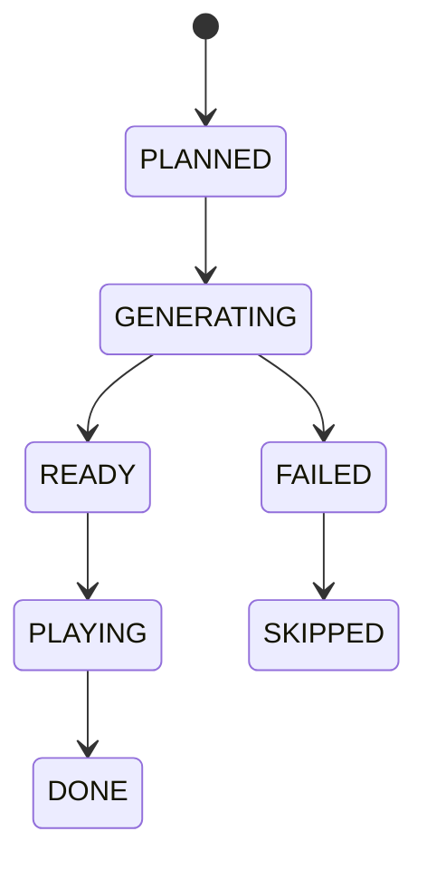

# AIローカルラジオアプリ プレイアウト・キュー制御設計書

## 1. 目的

本書は番組連続再生を止めないための `Queue`, `Buffer`, `Segment Lifecycle`, `Fallback` を定義する。

## 2. 基本方針

- Server がキュー正本を持つ
- Client は順次再生する
- セグメントは 20 から 60 秒を目安とする
- `READY` セグメントを常時 2 件以上確保する
- 失敗時は再生停止より代替再生を優先する

## 3. セッション状態

| 状態 | 説明 |
|---|---|
| `IDLE` | 局未選択 |
| `PREPARING` | 局切替直後で初期キュー生成中 |
| `PLAYING` | 通常再生中 |
| `DEGRADED` | 代替セグメントを使用中 |
| `STOPPED` | 明示停止 |
| `ERROR` | 手動復旧が必要 |

状態遷移は `playout_session.state` を正本とする。

## 4. QueueItem ライフサイクル

## 5. バッファ制御

### 5.1 初期値

- `targetReadyCount = 3`
- `minimumReadyCount = 2`
- `minReadyDurationMs = 90000`

### 5.2 補充条件

以下のいずれかを満たしたら先読み生成ジョブを投入する。

- Ready 件数が 2 未満
- Ready 合計見積時間が 90 秒未満
- MusicGen セグメントが先頭 3 件以内にある

## 6. セグメント選定ルール

優先順位:

1. `LETTER` の採用待ちがある場合は定義比率に応じて差し込む
2. `MUSIC_AI` は高遅延のため連続投入しない
3. `TALK` は局人格と直前文脈を継承する
4. `MUSIC_LOCAL` と `JINGLE` はフォールバック要員も兼ねる

MVP の初期編成比率の例:

- `TALK`: 50%
- `MUSIC_LOCAL`: 30%
- `LETTER`: 15%
- `JINGLE`: 5%

## 7. 局切替シーケンス

1. 現在 `PLAYING` 中の item を `finishing` 扱いにする
2. 新しい `playout_session` を作成する
3. 新局の `QueueItem` を 3 件計画する
4. 先頭 item を優先ジョブとして生成する
5. `radio.status.changed` と `queue.updated` を Client に通知する
6. Client は旧 item 終了または即時停止後に新先頭 item を再生する

Tune 時の目標:

- 5 秒以内に新局の最初の音が出ること

## 8. 再生イベント

Client は以下を Server に通知する。

- `SEGMENT_STARTED`
- `SEGMENT_ENDED`
- `SEGMENT_ERROR`
- `PLAYBACK_STOPPED`

Server はこの通知を監査とズレ検知に使う。Server の Queue 正本自体はこの通知なしでも進められるようにする。

## 9. フォールバック優先順位

### 9.1 TALK 生成失敗

1. キャッシュ済み同種 TALK
2. 既定の短い告知ジングル
3. ローカル音源
4. 無音は最後の手段とし、通常運用では避ける

### 9.2 TTS 失敗

1. 別 VoiceProfile
2. 同一台本の別 TTS Provider
3. テキストのみ字幕表示してジングル挿入

### 9.3 MusicGen 失敗

1. キャッシュ済み AI 音楽
2. ローカル音源
3. ジングル
4. TALK 置換

## 10. 相関ID

- Tune 要求ごとに `correlationId` を採番する
- 同一セグメントに紐づく `SCRIPT_GEN`, `TTS_GEN`, `MUSIC_GEN` は同じ `correlationId` を継承する
- 監視画面は `correlationId` 単位で異常経路を追えるようにする

## 11. JobRunr の使い方

| ジョブ | 役割 |
|---|---|
| `WarmupQueueJob` | 新局の初期キュー作成 |
| `GenerateScriptJob` | TALK / LETTER 台本生成 |
| `GenerateTtsJob` | 音声生成 |
| `GenerateMusicJob` | AI 音楽生成 |
| `QueueRefillJob` | 先読み不足補充 |
| `CleanupCacheJob` | 孤児ファイルと期限切れ削除 |

## 12. 見落とし防止ルール

- 先頭 `QueueItem` は後続より優先度を高くする
- 高遅延の `MUSIC_AI` を先頭へ置く場合は代替候補を同時に計画する
- Client で再生失敗した asset は再利用禁止フラグを付ける
- `DEGRADED` 状態から復帰したら、次の通常セグメントで状態を戻す
