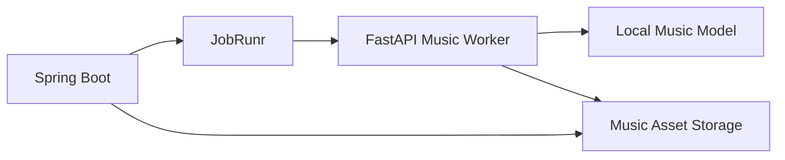

# AIローカルラジオアプリ MusicGen連携設計書

## 1. 目的

本書はローカル AI 音楽生成を `Server` から安全に利用するための非同期連携方式を定義する。

## 2. 採用方針

- MusicGen は Java 本体へ直接組み込まず `Python Worker` として分離する
- Worker は `FastAPI` による HTTP API を第一候補とする
- モデル候補は要件に合わせ `ACE-Step 系` を第一候補とし、差し替え可能にする
- 高遅延前提のため再生系とジョブ系を切り分ける

## 3. 構成



## 4. Worker API

### 4.1 `POST /music/jobs`

```json
{
  "requestId": "music-001",
  "stationId": "station-night",
  "mode": "BGM",
  "genre": "ambient",
  "mood": ["calm", "night"],
  "durationSec": 45,
  "seed": 42
}
```

Response:

```json
{
  "jobId": "worker-job-001",
  "status": "QUEUED"
}
```

### 4.2 `GET /music/jobs/{jobId}`

```json
{
  "jobId": "worker-job-001",
  "status": "SUCCEEDED",
  "assetPath": "/data/assets/music/music-001.wav",
  "durationSec": 45,
  "providerFingerprint": "ace-step:1.0",
  "promptHash": "abc123"
}
```

## 5. ジョブ状態

| 状態 | 説明 |
|---|---|
| `QUEUED` | 受付済み |
| `RUNNING` | 生成中 |
| `SUCCEEDED` | 完了 |
| `FAILED` | 失敗 |
| `CANCELLED` | 中止 |

## 6. Server 側の扱い

- `GenerateMusicJob` が Worker へ依頼する
- Worker の `jobId` を `provider_job.external_ref` に保持する
- 完了後に `generated_asset` を作成し、該当 `queue_item` を `READY` に更新する
- 長時間待機中は `MUSIC_LOCAL` を代替候補として残す

## 7. キャッシュ方針

キャッシュキー:

- stationId
- mode
- genre
- mood tags
- duration
- seed
- provider fingerprint

同一キーがあれば再生成より再利用を優先する。

## 8. フォールバック

1. キャッシュ済み AI 音楽
2. ローカル音源
3. ジングル
4. TALK 置換

MusicGen の失敗は `DEGRADED` として扱うが、セッション自体は継続する。

## 9. 監視項目

- キュー長
- 平均生成時間
- 失敗率
- GPU 使用率
- 直近 10 件の失敗理由

## 10. ライセンスと運用注意

- モデル本体ライセンス
- 学習済み重みの再配布条件
- 生成物の利用条件
- サンプル音源の扱い

上記は実装前に [11_運用・監視・セキュリティ・テスト設計書.md](./11_運用・監視・セキュリティ・テスト設計書.md) のライセンス台帳へ記録する。
