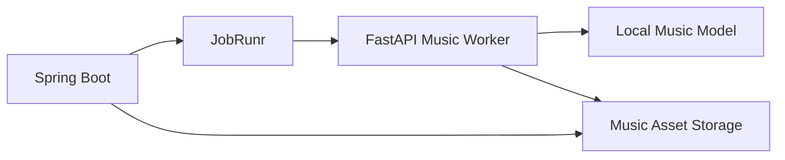

# AIローカルラジオアプリ MusicGen連携設計書

## 1. 目的

本書はローカル AI 音楽生成を `Server` から安全に利用するための非同期連携方式を定義する。

## 2. 採用方針

- MusicGen は Java 本体へ直接組み込まず `Python Worker` として分離する
- Worker は `FastAPI` による HTTP API を第一候補とする
- モデル候補は要件に合わせ `ACE-Step 系` を第一候補とし、差し替え可能にする
- 高遅延前提のため再生系とジョブ系を切り分ける

## 3. 構成



## 4. Worker API

### 4.1 `POST /music/jobs`

```json
{
  "requestId": "music-001",
  "stationId": "station-night",
  "mode": "BGM",
  "genre": "ambient",
  "mood": ["calm", "night"],
  "durationSec": 45,
  "seed": 42
}
```

Response:

```json
{
  "jobId": "worker-job-001",
  "status": "QUEUED"
}
```

### 4.2 `GET /music/jobs/{jobId}`

```json
{
  "jobId": "worker-job-001",
  "status": "SUCCEEDED",
  "assetPath": "/data/assets/music/music-001.wav",
  "durationSec": 45,
  "providerFingerprint": "ace-step:1.0",
  "promptHash": "abc123",
  "errorCode": null,
  "message": "generated"
}
```

## 5. ジョブ状態

| 状態 | 説明 |
|---|---|
| `QUEUED` | 受付済み |
| `RUNNING` | 生成中 |
| `SUCCEEDED` | 完了 |
| `FAILED` | 失敗 |
| `CANCELLED` | 中止 |

## 6. Server 側の扱い

- `GenerateMusicJob` が Worker へ依頼する
- Worker の `jobId` を `provider_job.external_ref` に保持する
- 完了後に `generated_asset` を作成し、該当 `queue_item` を `READY` に更新する
- 長時間待機中は `MUSIC_LOCAL` を代替候補として残す

現行サーバー実装では、`GenerateMusicJob` 自体は先行実装し、worker 未接続時は placeholder asset を作って queue を前進させられるようにする。`workers/musicgen` を追加した時点で `external_ref` と 실제 worker API 呼び出しへ差し替える。

2026-03-29 時点の実装メモ:

- `workers/musicgen` に FastAPI worker を追加し、`POST /music/jobs`, `GET /music/jobs/{jobId}`, `GET /health` を実装した
- worker 内部の生成器は実モデル未接続のため deterministic な WAV 生成を行い、Server と Worker の非同期契約を先に成立させる
- Server は `GenerateMusicJob -> MusicGenWorkerGateway -> generated_asset/provider_job` の経路で `submit -> poll -> asset 登録 -> READY` を実行する
- Server は worker 呼び出し前に `generated_asset.cache_key` を検索し、同一条件の音源があれば再利用を優先する
- worker 失敗時は `provider_job.error_code` を更新し、session を `DEGRADED` として queue refill を再要求する

## 7. キャッシュ方針

キャッシュキー:

- stationId
- mode
- genre
- mood tags
- duration
- seed
- provider fingerprint

同一キーがあれば再生成より再利用を優先する。cache hit 時も現在の `queue_item` と `provider_job` を追跡できるよう、Server は同じ `storage_path` を指す新しい `generated_asset` レコードを作成して返す。

## 8. フォールバック

1. キャッシュ済み AI 音楽
2. ローカル音源
3. ジングル
4. TALK 置換

MusicGen の失敗は `DEGRADED` として扱うが、セッション自体は継続する。現行実装では `GenerateMusicJob` が失敗 item を `FAILED` にし、queue refill を再要求して代替セグメントへ進める。

## 9. 監視項目

- キュー長
- 平均生成時間
- 失敗率
- GPU 使用率
- 直近 10 件の失敗理由

## 10. ライセンスと運用注意

- モデル本体ライセンス
- 学習済み重みの再配布条件
- 生成物の利用条件
- サンプル音源の扱い

上記は実装前に [11_運用・監視・セキュリティ・テスト設計書.md](./11_運用・監視・セキュリティ・テスト設計書.md) のライセンス台帳へ記録する。
