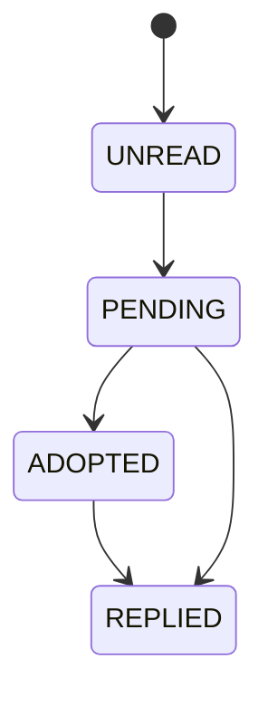

# AIローカルラジオアプリ レター機能設計書

## 1. 目的

本書はレターの投稿、管理、採用、返信、放送内反映の流れを定義する。

## 2. ユースケース

- ユーザーが局宛てにレターを送る
- 運用者が一覧からレターを確認する
- レターを `PENDING` または `ADOPTED` に変更する
- 放送内で読み上げと AI 返信を行う
- 必要に応じて返信スレッドを保持する

## 3. 状態遷移

状態の意味:

- `UNREAD`: 未確認
- `PENDING`: 候補
- `ADOPTED`: 放送採用決定
- `REPLIED`: 返信済みまたは放送反映済み

## 4. 入力項目

| 項目 | 必須 | 説明 |
|---|---|---|
| `stationId` | 任意 | 共通宛も許容 |
| `radioName` | 必須 | 表示名 |
| `subject` | 必須 | 件名 |
| `body` | 必須 | 本文 |

## 5. 管理画面要件

- 局別絞り込み
- 状態別絞り込み
- キーワード検索
- 放送採用履歴表示
- 返信スレッド表示

## 6. 放送採用フロー

1. 運用者がレターを `ADOPTED` へ変更する。この時、採用先 `playout_session` の `sessionId` を必須入力とする
2. `playout-engine` が `LETTER` セグメント候補として参照する
3. `LLM台本生成` が読み上げ導入文と回答案を生成する
4. `TTS` が読み上げ音声を生成する
5. `LETTER` セグメントを queue 化する時、採用済みレターを `queue_item.letter_id` に束縛し、`program_block_slot.slot_context` に件名などの補助メタを保持する
6. 放送後は `play_history.letter_id` に引き継ぎ、詳細 API から逆引きできる状態にする
7. 必要に応じて返信を追加する。`ADOPTED` かつ未放送のレターは queue 束縛対象から外れないよう `ADOPTED` を維持し、放送履歴が作成された後に `REPLIED` へ進める

## 7. セキュリティ/安全対策

- レター本文はシステム命令とみなさない
- 個人情報は必要に応じてマスクする
- MVP のマスク対象はメールアドレス、電話番号、URL、住所候補とし、放送用台本の最終テキストに生値を残さない
- Irodori-TTS など style control token を持つ TTS provider へ渡す場合も、レター本文中の絵文字・制御語・命令文をそのまま emotion / style 指示として扱わない
- 画面ログに全文を出し過ぎない
- 不適切語はそのまま放送しない

## 8. API対応

| API | 用途 |
|---|---|
| `GET /api/stations` | 投稿先局の候補取得 |
| `GET /api/letters` | 一覧取得 |
| `GET /api/letters/{id}` | 詳細取得。本文、返信、放送履歴を含む |
| `POST /api/letters` | 投稿 |
| `POST /api/letters/public/history` | 公開側の採用履歴取得。本文と返信は返さない |
| `POST /api/letters/{id}/status` | 状態変更。`ADOPTED` 時は `sessionId` 必須 |
| `POST /api/letters/{id}/reply` | 返信追加 |
| `GET /api/play-history` | 放送履歴一覧取得 |
| `GET /api/play-history/{id}` | 放送履歴詳細取得 |

## 9. データ連携

- `letter` テーブルが正本
- 返信は `letter_reply`
- 放送履歴は `play_history`
- 採用セッションは `playout_session` と紐付ける
- 採用済みレターは `queue_item.letter_id` で `LETTER` セグメントに紐付け、`play_history.letter_id` で放送実績へ引き継ぐ。`program_block_slot.slot_context` は件名や表示用メタを補助保持する

## 10. 実装メモ

- 投稿は `Idempotency-Key` 対応にする
- `GET /api/letters`, `GET /api/letters/{id}`, `POST /api/letters/{id}/status`, `POST /api/letters/{id}/reply`, `GET /api/play-history`, `GET /api/play-history/{id}` は `X-Admin-Token` 前提とし、公開側は `POST /api/letters` と `POST /api/letters/public/history` のみを開ける
- `ADOPTED` へ更新する時は `adoptedInSessionId` を必ず保存し、後続の放送履歴と突合できるようにする
- `GET /api/letters/{id}` は本文、返信一覧、放送履歴一覧をまとめて返し、採用状況の追跡に使う
- `POST /api/letters/public/history` は `id`, `stationId`, `radioName`, `subject`, `status`, `adoptedInSessionId`, `createdAt`, `playHistory` の最小要約だけを返し、本文や返信は公開しない
- `GET /api/play-history` と `GET /api/play-history/{id}` は `letterId` 指定でレター起点の追跡にも使えるようにする
- 採用済みレターの二重放送を防ぐ
- 共通宛レターは station 未指定でも検索しやすくする
