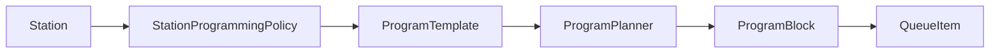

# AIローカルラジオアプリ 局管理・番組編成制御設計書

## 1. 目的

本書は既存の局切替制御に加えて、局ごとの自動番組生成をある程度制御できる仕組みを定義する。対象は `station` の管理、番組構成テンプレート、時間帯や状況に応じた自動選択、キュー生成への橋渡しである。

## 2. 背景

- 既存設計では局の人格や周波数は管理できるが、自動生成される番組の構成は固定比率中心である
- 局ごとに「深夜は長めのトーク中心」「朝は短尺でテンポよく」「レターが溜まったら紹介回を増やす」といった制御を追加したい
- ただし手動で全セグメントを完全固定するのではなく、自動生成の自由度と縮退運転を残したい

## 3. 基本方針

- `Station` と `Program` を別レイヤーとして扱う
- `Station` はブランド、周波数、人格、既定音声などの局の正体を管理する
- `ProgramTemplate` は番組の構成方針、時間帯、話題傾向、セグメント制約を管理する
- `Server` が有効な番組構成と実行中の番組ブロックの正本を持つ
- 番組構成は `HARD` 制約と `SOFT` 制約に分けて、自動生成を縛り過ぎない
- 有効な番組構成が見つからない時や計画生成に失敗した時は、既存の固定比率ベースへ安全にフォールバックする
- 実行中セッションは解決済みテンプレートの version を固定し、編集中の設定変更で途中の番組構成が揺れないようにする

## 4. 用語

| 用語 | 役割 |
|---|---|
| `Station` | 局そのもの。周波数、名称、人格、既定音声などを持つ |
| `StationProgrammingPolicy` | その局でどの番組テンプレートをいつ使うかを決めるルール集合 |
| `ProgramTemplate` | 番組の雛形。構成、尺、話題傾向、レター採用方針、音楽方針を持つ |
| `ProgramRule` | 時間帯、曜日、Provider 状態、レター滞留数などの条件でテンプレートを選ぶ規則 |
| `ProgramBlock` | 実行時に確定した 1 つの番組単位。通常は 10 から 30 分程度を想定する |
| `ProgramSlot` | `ProgramBlock` 内の個別構成要素。`OPENING`, `TALK_MAIN`, `LETTER`, `MUSIC_BREAK`, `ENDING` など |
| `ConstraintMode` | `HARD` は必須、`SOFT` は望ましいが代替可能な制約 |

## 5. 全体像



- 局の切替は従来どおり `Station` 単位で行う
- その局に紐づく `StationProgrammingPolicy` が現在時刻と運用条件から `ProgramTemplate` を選ぶ
- `ProgramPlanner` が `ProgramBlock` を作成し、`QueueRefill` はその `ProgramSlot` を元に `QueueItem` を補充する

## 6. 局管理設計

### 6.1 管理対象

局管理では最低でも以下を保持する。

- 局名、周波数、ジャンル、公開可否
- 既定人格、既定音声、読み辞書参照
- 局の説明、話題タグ、既定の番組編成ポリシー参照
- 自動番組生成を有効にするかどうかのフラグ

### 6.2 運用ルール

- 局は `isActive=false` にすることで非公開化できる
- 局を削除せず、基本は無効化またはアーカイブ扱いにする
- 既存局の複製から新局を作成できるようにし、人格や番組テンプレートの使い回しを可能にする
- 局の設定変更は監査対象とし、変更前後の version を記録する

### 6.3 局編集時の検証

- 既定人格と既定音声が存在すること
- 参照する `ProgramTemplate` が同一局または `GLOBAL` スコープに属すること
- `frequencyMHz` の重複ポリシーに違反しないこと
- `programmingEnabled=true` の場合は少なくとも 1 つ以上の有効な `ProgramRule` が存在すること

## 7. 番組編成制御設計

### 7.1 `ProgramTemplate`

`ProgramTemplate` は番組の雛形であり、以下の情報を持つ。

| 項目群 | 内容 |
|---|---|
| 基本情報 | `id`, `name`, `scope`, `stationId`, `version`, `isActive` |
| 時間条件 | 適用曜日、開始時刻、終了時刻、優先度、クールダウン |
| 尺 | `targetDurationMinutes`, `planningHorizonMinutes` |
| 構成 | `ProgramSlot` の並び、候補 `segmentType`, `ConstraintMode`, 目標尺 |
| 話題制御 | コアテーマ、話題タグ、避ける話題、温度感、テンポ |
| レター制御 | 紹介可能件数、未読優先、採用条件 |
| 音楽制御 | `MUSIC_LOCAL` / `MUSIC_AI` の優先度、AI 音楽許容有無 |
| フォールバック | 代替可能な `segmentType`, 失敗時の縮退テンプレート |

### 7.2 `ProgramSlot`

`ProgramSlot` は番組内の 1 区間を表す。

| 項目 | 説明 |
|---|---|
| `slotId` | スロット識別子 |
| `role` | `OPENING`, `TOPIC`, `LETTER`, `MUSIC_BREAK`, `ENDING` など |
| `candidateSegmentTypes` | `TALK`, `LETTER`, `MUSIC_LOCAL`, `MUSIC_AI`, `JINGLE` の候補 |
| `constraintMode` | `HARD` または `SOFT` |
| `targetDurationMs` | 目標尺 |
| `topicHints` | この区間で扱いたい話題 |
| `requiredPhrases` | 必ず含めたい要素 |
| `fallbackSegmentTypes` | 失敗時の代替候補 |

### 7.3 `HARD` と `SOFT`

- `HARD`: 必ず守る。例としてオープニングジングル、エンディング、レター紹介枠の上限、AI 音楽を使わない宣言番組など
- `SOFT`: できれば守る。例として talk 率、盛り上がり曲線、サブトピックの優先度、ジングル差し込み間隔など

これにより、編成側は番組の輪郭を指定でき、実行時は Provider 状態やレター在庫に応じて柔軟に崩せる。

### 7.4 `ProgramRule`

`ProgramRule` は `ProgramTemplate` を選ぶための条件である。判定には以下を使う。

- 曜日と時間帯
- 現在の `stationId`
- 未採用レター件数
- `MusicGen` や `TTS` の health
- 直近に使用したテンプレート履歴
- 管理者による一時 override の有無

解決順序は `priority` 降順、次に条件一致度、最後に `defaultTemplateId` とする。

### 7.5 例

```json
{
  "id": "tmpl-night-letter",
  "name": "深夜レター拾い",
  "scope": "STATION",
  "stationId": "station-night",
  "version": 3,
  "targetDurationMinutes": 20,
  "planningHorizonMinutes": 15,
  "slots": [
    {
      "slotId": "open",
      "role": "OPENING",
      "candidateSegmentTypes": ["JINGLE", "TALK"],
      "constraintMode": "HARD",
      "targetDurationMs": 30000,
      "fallbackSegmentTypes": ["TALK"]
    },
    {
      "slotId": "letter-main",
      "role": "LETTER",
      "candidateSegmentTypes": ["LETTER", "TALK"],
      "constraintMode": "HARD",
      "targetDurationMs": 120000,
      "topicHints": ["最近届いたレター", "夜更かし"],
      "fallbackSegmentTypes": ["TALK"]
    },
    {
      "slotId": "music-break",
      "role": "MUSIC_BREAK",
      "candidateSegmentTypes": ["MUSIC_LOCAL", "MUSIC_AI"],
      "constraintMode": "SOFT",
      "targetDurationMs": 180000,
      "fallbackSegmentTypes": ["JINGLE", "TALK"]
    }
  ]
}
```

## 8. 実行時の番組生成フロー

### 8.1 生成単位

- `ProgramBlock` は 10 から 30 分程度の単位で先に計画する
- キューは `ProgramBlock` すべてを即時実体化せず、先頭から必要分だけ `QueueItem` に変換する
- 残り `ProgramSlot` が少なくなったら次の `ProgramBlock` を非同期で計画する

### 8.2 フロー

1. Tune または `QueueRefill` が `ProgramPlanningRequired` を検知する
2. `ProgrammingService` が `StationProgrammingPolicy` を読み込む
3. `ProgramRuleResolver` が現在時刻、Provider health、レター在庫から `ProgramTemplate` を選ぶ
4. `ProgramPlanner` が `ProgramBlock` と `ProgramSlot` 一覧を確定する
5. `QueuePlanner` が先頭に近い `ProgramSlot` を `QueueItem` へ変換する
6. `GenerateScriptJob` や `GenerateMusicJob` は `ProgramSlot` の制約を引き継いで生成する
7. `ProgramBlock` 完了後に次の block へ進む

### 8.3 時間帯またぎ

- 番組途中で時間帯ルールが変わっても、進行中の `ProgramBlock` は原則最後まで維持する
- 次 block 作成時に新しい `ProgramRule` を再評価する
- 重大な override や障害時のみ途中打ち切りを許可する

### 8.4 版固定

- `ProgramBlock` には `programTemplateId` と `programTemplateVersion` を保存する
- 編集後のテンプレートは次の `ProgramBlock` から反映し、実行中 block の構成は変えない
- Preview API は未保存 payload を評価できるが、実行時 block には採用しない

## 9. キュー制御との接続

- 従来の固定比率は `legacyRatioFallback` として残す
- `ProgramSlot` がある場合、`QueueRefill` はまずそのスロットを満たす `segmentType` を優先する
- `SOFT` スロットで生成不能な場合は `fallbackSegmentTypes` を使って継続する
- `HARD` スロットでも致命的に生成不能な場合は、同一 role を満たす最小代替へ置き換えた上で監査イベントを残す
- `ProgramBlock` が存在しない、または解決不能な場合のみ固定比率へ戻る

## 10. 管理画面に求める操作

- 局一覧、作成、複製、無効化
- 局ごとの既定人格、既定音声、番組編成ポリシー編集
- `ProgramTemplate` の一覧、複製、バージョン確認
- 時間帯ルールの編集
- Preview 実行
- 現在適用中の `ProgramBlock` と次候補の確認

## 11. API とデータへの要求

- 管理系 API は `X-Admin-Token` を要求する
- `GET /api/radio/status` と `GET /api/radio/program` から現在の番組ブロックを参照できる
- `QueueItem` から `programBlockId` と `programSlotId` を参照できる
- DB には `ProgramTemplate`, `ProgramRule`, `ProgramBlock`, `ProgramSlot` を保存する
- `config.json` には初期 seed と全局共通の planning 既定値のみを保持し、運用中の正本は DB とする

## 12. 縮退と安全性

- `ProgramRule` 解決失敗時は `defaultTemplateId`、それも不可なら固定比率へ戻す
- `MusicGen` が `DOWN` の時は `MUSIC_AI` を含むテンプレートを避けるか `MUSIC_LOCAL` へ変換する
- 無効なテンプレート参照や循環 fallback は保存時バリデーションで弾く
- プロンプト生成に局設定や番組テンプレートを使う時も、レター本文は命令として扱わない
- 番組テンプレート本文やレター引用全文は標準ログへ出さない

## 13. 互換と移行

- 既存の局は `programmingEnabled=false` でも動作可能とし、段階導入を許容する
- `ProgramTemplate` が未設定でも、現行の局切替とキュー制御は維持する
- 共有 API 契約の追加は後方互換を保つ範囲で行い、既存 Client は新フィールドを無視できる前提とする
