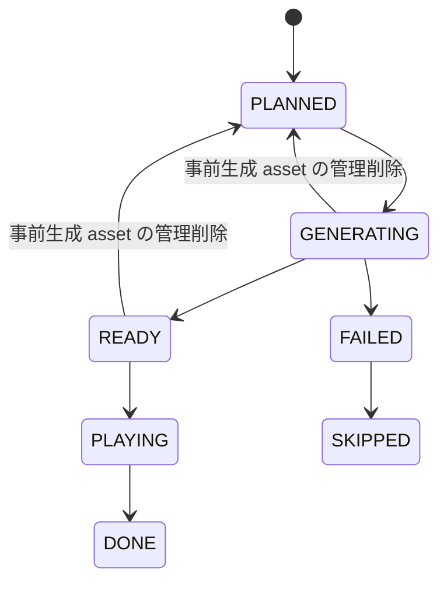

# AIローカルラジオアプリ プレイアウト・キュー制御設計書

## 1. 目的

本書は番組連続再生を止めないための `Queue`, `Buffer`, `Segment Lifecycle`, `Fallback` を定義する。

## 2. 基本方針

- Server がキュー正本を持つ
- Client は順次再生する
- キュー補充は固定比率ではなく、可能な限り有効な `ProgramBlock` を優先する
- セグメントは 20 から 60 秒を目安とする
- `READY` セグメントを常時 2 件以上確保する
- 失敗時は再生停止より代替再生を優先する

## 3. セッション状態

| 状態 | 説明 |
|---|---|
| `IDLE` | 局未選択 |
| `PREPARING` | 局切替直後で初期キュー生成中 |
| `PLAYING` | 通常再生中 |
| `DEGRADED` | 代替セグメントを使用中 |
| `STOPPED` | 明示停止 |
| `ERROR` | 手動復旧が必要 |

状態遷移は `playout_session.state` を正本とする。

## 4. QueueItem ライフサイクル

実装上は QueueItem を `READY` または `GENERATING` で作成することがある。`SEGMENT_ERROR` や非同期生成失敗で `QueueItem` を `FAILED` にした場合は、対応する `ProgramBlockSlot` を `SKIPPED` に進め、block 完了判定が詰まらないようにする。
管理画面から `PRE_GENERATION` asset を物理削除した場合は `queue_item.assetId`, `assetUrl` を解除し、`contentOrigin=DELETED`, `status=PLANNED` とする。オフエア session だけが対象なのでライブ SSE は更新しない。削除と非同期 MusicGen 完了が競合し、完了時点で queue が `GENERATING` でなくなっていた場合は、新しく登録された未参照 asset を直ちに破棄し、削除後に孤児 record が復活しないようにする。

## 5. バッファ制御

### 5.1 初期値

- `targetReadyCount = 3`
- `minimumReadyCount = 2`
- `minReadyDurationMs = 90000`
- `maxPreparedDurationMs = 480000`
- `maxPreparedBlocks = 2`
- 初期キュー作成と先読み補充は、`after-commit` で JobRunr ジョブへ委譲し、`Tune` 応答は `PREPARING` のまま返す

### 5.2 補充条件

以下のいずれかを満たしたら先読み生成ジョブを投入する。

- Ready 件数が 2 未満
- Ready 合計見積時間が 90 秒未満
- 残り `ProgramSlot` が 2 件未満
- MusicGen セグメントが先頭 3 件以内にある

実装上は `RadioService` が queue warmup/refill の orchestration を担当し、ready 件数、ready duration、prepared block 数、ahead count の有効値計算は `QueuePreparationPolicy` 相当へ集約する。ここでいう ready 件数の「安全バッファ」は `minimumReadyCount` と `minReadyDurationMs` で判定し、`targetReadyCount` は安全バッファ達成後に余裕を作るための目標値として扱う。

### 5.3 先行生成の深さ

- 全局共通の上限は `config.playout.maxPreparedDurationMs`, `maxPreparedBlocks`, `scriptAheadCount`, `ttsAheadCount`, `musicAheadCount` で制御する
- station ごとの `preGeneration.mode` が `REALTIME_ONLY` の場合は最小 buffer だけを維持する
- `ASSISTED` の場合は現在 block と次 block の一部まで先行生成し、cache hit がある asset を優先する
- `AGGRESSIVE` の場合は `SOFT` slot を中心に次 block の TALK / MUSIC を余剰時間で先行生成してよい
- いずれの場合も `LETTER` は採用直後の鮮度を優先し、既定では current block 先頭寄りのみ先行生成対象とする

現行 runtime では `preGeneration` の first step として、station ごとの `mode`, `maxPreparedMinutes`, `maxPreparedBlocks` を queue planning に反映する。`REALTIME_ONLY` は `minimumReadyCount` 相当の最小 buffer を優先し、current block に未完了 slot が残る間は次 block を先行計画しない。`ASSISTED` は既存どおり current block と次 block の一部まで、`AGGRESSIVE` は残 slot 閾値を少し早めて次 block planning に入る。station 側の `maxPreparedMinutes` / `maxPreparedBlocks` は global `playout` 上限を超えない範囲でのみ効く。加えて `preferCacheReuse=true` の場合は MusicGen queue item の reusable asset lookup を許可し、`false` の場合は reusable asset が存在しても worker submit を優先する。`musicAheadCount` は `MUSIC_AI` の同時生成深さを制御しつつ、current block の `MUSIC_AI` を最優先で活性化し、future block 側は `REALTIME_ONLY` では抑止、`ASSISTED` では next block 先頭寄り 1 件まで、`AGGRESSIVE` では残枠ぶん許可する。`0` でも直近再生候補 1 件の生成は維持する。`scriptAheadCount` / `ttsAheadCount` も first step として反映し、queue warmup/refill のたびに future spoken queue item を走査して、TTS audio asset を `ttsAheadCount` 件ぶん、script snapshot を `scriptAheadCount` 件ぶんまで先行生成する。`ttsAheadCount=0` でも次に再生される spoken item 1 件ぶんの audio は維持し、script 深さは audio 深さより浅くしない。現行 SeedShiftRadio の Irodori adapter のように upstream の chunk-level SSE を使わず完成音声を返す経路は、先頭 item の直前同期生成に寄せると Tune 目標を壊しやすいため、`ttsAheadCount` と cache hit を優先して `READY` 化してから再生へ渡す。Irodori provider が 503 queue timeout や model load timeout を返した場合は、同じ台本で fallback TTS provider へ切り替え、queue 全体の READY 件数維持を優先する。`LETTER` は鮮度優先のため、既定では current block に属する最初の upcoming letter 1 件だけを先行生成対象にし、後続 letter や next block の letter は ahead window へ入れない。`idlePrefetchEnabled=false` の場合は、manual play を待っていて `minimumReadyCount` / `minReadyDurationMs` を満たした後の extra prefetch を最小化し、active playback 中や `resumePlayback=true` の warmup では従来どおり ahead depth を使う。これらの ready/buffer/ahead の有効値計算は `QueuePreparationPolicy` 相当で集中管理し、`RadioService` は block 作成、QueueItem 追加、asset prefetch、MusicGen job 起動の orchestration に留める。ahead depth は `READY` 件数・`READY` duration・`REALTIME_ONLY` の next block 抑制の意味を変えない。archive replay quota や `LETTER` の鮮度優先は従来どおり別経路で扱う。

## 6. セグメント選定ルール

優先順位:

1. 有効な `ProgramBlock` がある場合は、先頭未処理 `ProgramSlot` を最優先で満たす
2. 同一 `segmentType` と `contentHash` に対する exact cache hit があれば先に再利用する
3. `HARD` な `ProgramSlot` は同一 role を保った代替を優先する
4. `SOFT` な `ProgramSlot` は Provider 状態、レター在庫、station `replayPolicy` に応じて `fallbackSegmentTypes` や `broadcast_archive` を許容する
5. `MUSIC_AI` は高遅延のため連続投入しない
6. `TALK` は局人格、現在番組、直前文脈、station `compositionPolicy` を継承する
7. `MUSIC_LOCAL` と `JINGLE` はフォールバック要員も兼ねる

現行 runtime では `compositionPolicy` のうち `maxConsecutiveTalkSegments`, `musicBreakIntervalMinutes`, `letterPriorityBoostThreshold`, `allowSoftFallbackRetiming`, `targetSegmentShares` を `SOFT` slot の解決へ反映する。未採用レター件数が閾値以上なら `LETTER` 候補を優先し、連続 talk 上限や music break 間隔を超える場合は `MUSIC_LOCAL` / `MUSIC_AI` / `JINGLE` が候補にあればそちらを優先する。加えて `targetSegmentShares` は `candidateSegmentTypes` 内の候補順調整として使い、現時点では fallback を強制せず、share 不足が大きい系統を優先する。`allowSoftFallbackRetiming=false` の場合はこれらの composition 起因の優先変更を行わず、candidate / fallback の通常解決順を維持する。

`ProgramBlock` を解決できない場合のみ、MVP の固定比率を fallback として使う。

- `TALK`: 50%
- `MUSIC_LOCAL`: 30%
- `LETTER`: 15%
- `JINGLE`: 5%

## 7. 局切替シーケンス

1. 既存の最新 `playout_session` があれば、current item を `READY` へ戻して `STOPPED` に遷移させる
2. 新しい `playout_session` を作成する
3. 新局の `ProgramBlock` を 1 件計画する
4. block 先頭寄りの `QueueItem` を 3 件計画し、station `preGenerationPolicy` が許せば次 block の一部も先行準備する
5. `MUSIC_AI` は `GENERATING` で登録し `GenerateMusicJob` に委譲し、それ以外は `generated_asset` を確保して `queue_item.assetId` を埋める
6. `radio.status.changed`, `queue.updated` と必要時 `program.changed` を Client に通知する
7. Client は旧 item 終了または即時停止後に新先頭 item を再生する

Tune 時の目標:

- 5 秒以内に新局の最初の音が出ること
- `resumePlayback=false` の場合、`POST /api/radio/tune` の応答時点では `playout_session.state=PREPARING` を返し、初期 `ProgramBlock` と先頭 `QueueItem` を作成する
- `resumePlayback=true` の場合も `POST /api/radio/tune` の初回応答は `PREPARING` とし、after-commit の warmup 完了後に Server が先頭 `READY` item を自動で `PLAYING` へ進めてよい
- `resumePlayback=true` の session では、以後の先頭 item への繰り上がりも Server 主導で継続してよい。Client からの `/api/radio/play` や `SEGMENT_STARTED` は同一 item に対して冪等に受け付ける
- `QueueRefillJob` は `READY` 件数・`READY` 時間・残 `ProgramSlot` を見て、必要時だけ追加の補充と次 `ProgramBlock` 計画を行う
- `PrepareAheadJob` は station `preGenerationPolicy` と global `playout` 上限を見て、script/TTS/music の先行生成を補助する
- Provider 未接続の server skeleton では `generated_asset` と `/api/assets/audio/{assetId}.wav` の placeholder 音声、および fallback jingle を用いて Queue 契約と SSE 契約を先に満たす

## 8. 再生イベント

Client は以下を Server に通知する。

- `SEGMENT_STARTED`
- `SEGMENT_ENDED`
- `SEGMENT_ERROR`
- `PLAYBACK_STOPPED`

Server はこの通知を監査とズレ検知に使う。Server の Queue 正本自体はこの通知なしでも進められるようにする。

- `sessionId` と `itemId` は同一 `playout_session` に属していることを必須とする
- 同一 `playout_session` に `PLAYING` な `QueueItem` は常に 1 件までとする
- `PLAYBACK_STOPPED` または管理 API の `stop` では、未完了の current item を `READY` へ戻し、`currentQueueItemId` をクリアする
- `SEGMENT_ENDED` と `PLAYBACK_STOPPED` は current item を受理し、不正な前状態は `409` とする
- 通信再送や Client のイベント競合で同じ終端通知が届いても、`DONE` item への `SEGMENT_ENDED` と `FAILED` item への `SEGMENT_ERROR` は冪等に受理し、状態更新、履歴、補充を重複させない
- `SEGMENT_ENDED`, `SEGMENT_ERROR`, `PLAYBACK_STOPPED`, 管理 API の `stop` は `play_history` に結果を記録する
- `LETTER` セグメントを queue 化する時は、採用済みレターを session 内で 1 回だけ `queue_item.letter_id` へ束縛し、`play_history.letter_id` へ引き継ぐ。`program_block_slot.slot_context` には件名などの補助メタを保持してよい

## 9. フォールバック優先順位

Provider 実行失敗は `PROVIDER_UNREACHABLE`, `PROVIDER_TIMEOUT`, `PROVIDER_BAD_RESPONSE`, `PROVIDER_REJECTED`, `PROVIDER_RESOURCE_EXHAUSTED`, `PROVIDER_AUTH_FAILED`, `PROVIDER_INTERRUPTED` と、TTS 固有の `VOICE_REF_NOT_FOUND`, `VOICE_CONSENT_REQUIRED` に正規化する。

Provider chain の fallback を許可するのは `PROVIDER_UNREACHABLE`, `PROVIDER_TIMEOUT`, `PROVIDER_BAD_RESPONSE`, `PROVIDER_RESOURCE_EXHAUSTED`, `VOICE_REF_NOT_FOUND`, `VOICE_CONSENT_REQUIRED` とする。
`PROVIDER_REJECTED`, `PROVIDER_AUTH_FAILED`, `PROVIDER_INTERRUPTED` では同じ要求を別 Provider へ自動送信しないが、安全な cache、archive、local asset、placeholder による playout の縮退継続は行ってよい。

Provider の論理生成ジョブは `provider_job.status=FAILED` または `SUCCEEDED` とし、`DEGRADED` は追加しない。
現行 runtime は TTS の Provider 試行を個別 `provider_job` として残し、Music Generation の Provider chain は最終 Provider と論理ジョブの最終結果を一つの `provider_job` に残す。
fallback を使った session は `PlayoutState.DEGRADED` とし、`degraded_reason` には自由文ではなく最初の失敗を表す共通 error code を保存する。
外部 Provider または Worker の未知 error code は `PROVIDER_BAD_RESPONSE` へ正規化する。

### 9.1 番組計画失敗

1. 同じ station の `defaultTemplateId` を再試行する
2. `legacyRatioFallback=true` なら固定比率の `QueueItem` を計画する
3. 監査イベントと `program.changed` を出し、UI に縮退理由を見せる

### 9.2 TALK 生成失敗

1. キャッシュ済み同種 TALK
2. `broadcast_archive` にある同局 TALK
3. 既定の短い告知ジングル
4. ローカル音源
5. 無音は最後の手段とし、通常運用では避ける

LLM Provider の失敗は共通 error code として `provider_job.error_code` に残す。
fallback 可能な error code では設定済みの次 Provider を試し、それでも台本を生成できない場合は本文や prompt を引き継がない安全な定型 TALK へ縮退する。
`PROVIDER_REJECTED` は safety block を含むため、同じ prompt を別 Provider へ自動送信しない。

### 9.3 TTS 失敗

1. 別 VoiceProfile
2. 同一台本の別 TTS Provider
3. 既存 audio cache の再利用
4. テキストのみ字幕表示してジングル挿入

Irodori-TTS 固有の失敗では、`VOICE_REF_NOT_FOUND` / `VOICE_CONSENT_REQUIRED` は同一 provider で再試行せず、承認済み別 VoiceProfile または VOICEVOX fallback へ切り替える。`PROVIDER_RESOURCE_EXHAUSTED` / HTTP 503 / model load timeout は Provider 混雑として扱い、`ttsAheadCount` の対象外だった後続 item は無理に詰めず、既存 cache または短い fallback セグメントで READY 件数を確保する。`PROVIDER_REJECTED` は安全性ポリシーによる拒否を含み、同じ text / voice 指定を別 Provider へ自動送信しない。fallback 生成物は `content_origin=PLACEHOLDER` ではなく、実 TTS 音声なら `LIVE_GEN` または `CACHE_REUSED` として provider fingerprint で区別する。

### 9.4 Music Generation / ACE-Step 失敗

1. キャッシュ済み AI 音楽
2. `broadcast_archive` にある同局音楽
3. インスト BGM / ローカル音源
4. 短い DJ 案内またはジングル
5. 通常 TTS セグメントへの置換

歌もの生成は再生予定時刻までに `SUCCEEDED` でなければ縮退し、`provider_job.error_code` と監査イベントには分類済み理由のみを残す。Provider chain の fallback は許可された error code だけで行い、`PROVIDER_REJECTED`, `PROVIDER_AUTH_FAILED`, `PROVIDER_INTERRUPTED` では同じ prompt / lyrics を別 Provider へ自動送信しない。prompt / lyrics 本文、レター本文、radioName は queue payload や SSE payload へ含めない。
現行 runtime では非同期 `GenerateMusicJob` が `MUSIC_AI` item の生成に失敗した場合、同じ `QueueItem` を再利用して `paths.musicLibrary` 配下の `.wav` を優先的に `MUSIC_LOCAL` `READY` へ差し替え、候補が無ければ placeholder asset 付き `JINGLE` `READY` へ降ろす。slot は `SKIPPED` にせず queue の順序を維持し、後続 `MUSIC_AI` の ahead 枠は別 item で継続する。
現行既定テンプレートは `TALK -> MUSIC_AI -> TALK` とし、Web の主再生操作は開始時の `ProgramBlock` を固定して末尾まで連続再生する。Server は現在 block の先頭未完了 item が `READY` でない場合に後続 item や次 block を開始せず、`SEGMENT_STARTED` による順序飛ばしも `409 PROGRAM_PLAYBACK_ORDER_CONFLICT` で拒否する。
`OPENING` / `ENDING` が効果音用 `JINGLE` として解決された場合、QueueItem と生成音源の目標時間は15秒とする。テンプレートの既定 target も15秒へ移行し、長い cue で番組本編を圧迫しない。
MusicGen が利用できない場合は中央 slot を `MUSIC_LOCAL`、最終的に `JINGLE` へ縮退し、無音のまま番組を停止しない。
音源ライブラリ未登録時の `MUSIC_LOCAL` placeholder は短い効果音ではなく、和音、ベース、旋律、リズムを持つ番組用 BGM とする。警告や区切り用途の短い cue は `JINGLE` として区別する。

## 10. 相関ID

- Tune 要求ごとに `correlationId` を採番する
- 同一セグメントに紐づく `SCRIPT_GEN`, `TTS_GEN`, `MUSIC_GEN` は同じ `correlationId` を継承する
- 監視画面は `correlationId` 単位で異常経路を追えるようにする

## 11. JobRunr の使い方

| ジョブ | 役割 |
|---|---|
| `WarmupQueueJob` | 新局の初期キュー作成 |
| `PlanProgramBlockJob` | 番組 block 計画 |
| `PrepareAheadJob` | station 設定に応じた先行生成 |
| `GenerateScriptJob` | TALK / LETTER 台本生成 |
| `GenerateTtsJob` | 音声生成 |
| `GenerateMusicJob` | AI 音楽生成 |
| `PreGenerationJob` | 管理画面から要求されたオフエア番組の materialize |
| `PromoteArchiveCandidateJob` | 放送済み asset を再放送候補へ昇格 |
| `QueueRefillJob` | 先読み不足補充 |
| `CleanupCacheJob` | 孤児ファイルと期限切れ削除 |

- `WarmupQueueJob` と `QueueRefillJob` は `after-commit` で enqueue し、background job server が無効な profile や test では同一トランザクション完了後にインライン実行してもよい
- `GenerateMusicJob` も同様に `after-commit` で enqueue し、worker 未接続や生成失敗時は `paths.musicLibrary` の `.wav` か placeholder jingle asset を使って queue を `READY` へ進めてもよい
- `PreGenerationJob` は `playout_session.purpose=PRE_GENERATION` の専用 session に番組 block と queue item を作り、台本・TTS を materialize して `MUSIC_AI` を既存 `GenerateMusicJob` へ投入する
- オフエア session はライブ session の最新検索、radio status、現在番組、再生 queue、SSE を変更しない。MusicGen 完了・失敗時もライブ queue の補充や fallback 同期を起動しない
- 事前生成で `LETTER` slot を組み立てる場合も、ライブ放送への採用状態遷移やレター消費は行わない
- `PromoteArchiveCandidateJob` は `play_history.resultStatus=DONE` の保存後に `after-commit` で enqueue し、`playHistoryId`, `queueItemId`, `replayOfPlayHistoryId` などの ID だけを job payload として扱う
- `PromoteArchiveCandidateJob` は実行時に `play_history` と `queue_item` を DB から再読込し、station `replayPolicy` と safety 条件を満たす場合だけ `broadcast_archive` へ昇格する
- archive promotion や replay count 更新の失敗は playback event / `play_history` 記録を rollback させない。二重 enqueue や retry で同じ `source_play_history_id` が来た場合は既存昇格済みとして成功扱いにする
- その場合も状態遷移の正本は `playout_session` と `queue_item` に残し、ジョブ実行方式の違いで API 応答や SSE 契約を変えない

## 12. 見落とし防止ルール

- 先頭 `QueueItem` は後続より優先度を高くする
- 高遅延の `MUSIC_AI` を先頭へ置く場合は代替候補を同時に計画する
- 日本語歌もの生成は `PrepareAheadJob` / `GenerateMusicJob` の範囲で扱い、ライブ再生中の queue refill が provider 完了待ちで停止しないようにする
- Client で再生失敗した asset は再利用禁止フラグを付ける
- archive replay 起源の item は `SOFT` slot を優先し、station `maxReplaySharePercent` を block 単位で超えない
- block 単位の replay 上限は `ProgramBlock` の slot 件数に対して整数 slot へ切り下げて評価し、quota 超過時は archive replay を採用せず `LIVE_GEN` または通常 fallback で継続する
- `LETTER` は既定で archive replay へ昇格させず、明示許可がある場合のみ別設計で扱う
- `DEGRADED` 状態からは、fallback ではない通常 Provider 生成セグメントが成功した時点で `degraded_reason` を解除して状態を戻す
- 実行中 `ProgramBlock` の template version は固定し、途中の設定更新で差し替えない
